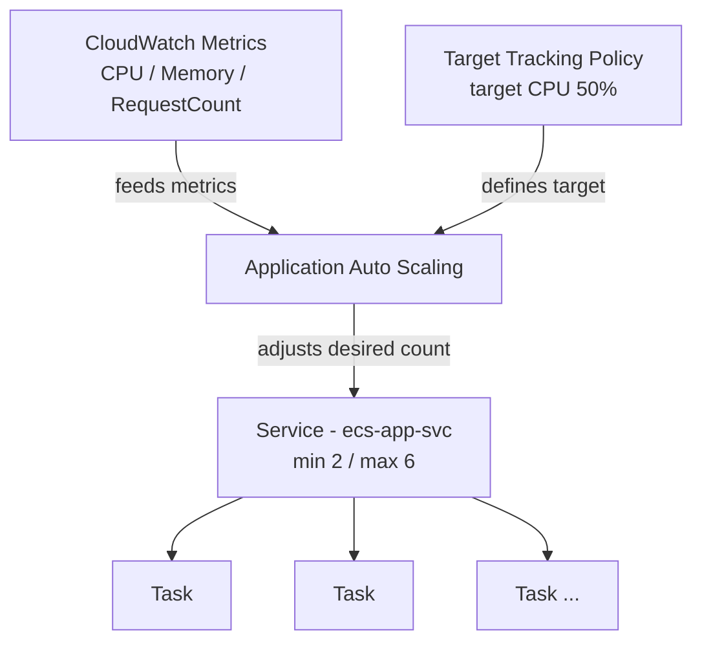
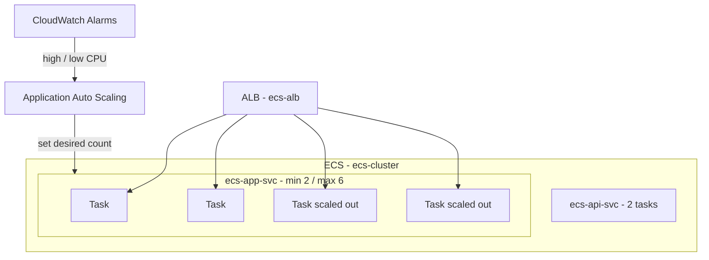

# Chapter 7 — Auto Scaling in ECS

Every team I've worked with hits the same wall eventually. You ship a service, you pick a task count that "feels right" on launch day, and then you forget about it. Six months later one of two things is true: you're running four tasks around the clock for a workload that only needs them two hours a day, or you're getting paged because a traffic spike walked straight through your fixed capacity and the service fell over.

Static capacity is a bet against the future, and the future always wins. The number that looked right at launch is wrong by Q2. So instead of betting, we let ECS adjust capacity based on what the service is actually doing right now. That's what this chapter is about: putting real auto scaling on `ecs-app-svc` so it grows under load and shrinks when it's idle, without anyone watching a dashboard.

**Region:** `eu-north-1` (or your preferred region)
**Launch type:** Fargate
**Inherited from Chapters 2–6:** `ecs-cluster`, `ecs-app-svc` (2 tasks), `ecs-api-svc` (2 tasks), ALB `ecs-alb`, target group `ecs-tg`

---

## What You'll Learn

- Why ECS service scaling is a different mechanism from EC2 Auto Scaling Groups, and why that distinction matters in practice
- How to size a scalable target so it protects you without writing a blank cheque
- When to choose target tracking, when to reach for step scaling, and when to scale on a metric you publish yourself
- How cooldowns prevent the flapping that makes scaling worse than no scaling
- How to attach all of this to the running `ecs-app-svc` and prove it works under load

---

## Theory: How Scaling Works in ECS

### This is not EC2 Auto Scaling

I'll start here because it's the most common point of confusion in interviews and incident reviews alike. EC2 Auto Scaling Groups add and remove virtual machines. ECS service scaling does not touch machines at all — on Fargate there are none to touch. It uses **AWS Application Auto Scaling** to change one number: the **desired count** of your service.

You declare a range, say two to six tasks, and Application Auto Scaling moves the desired count inside that range in response to metrics. ECS then schedules or drains tasks to match. The capacity question (where do these tasks physically run) is Fargate's problem, not yours.

> A useful way to hold it in your head: EC2 scaling manages the kitchen size. ECS service scaling just decides how many cooks are on shift tonight. The building never changes.

### The scalable target is your guardrail

Nothing scales until you register a **scalable target**, which is just the min and max desired count. For `ecs-app-svc` we'll use a minimum of 2 and a maximum of 6.

People treat these as throwaway numbers. They aren't. The minimum is your availability floor during quiet hours, and across two Availability Zones you almost never want it below 2. The maximum is doing double duty: it's your cost ceiling and your blast radius. I've seen a misconfigured load test scale a service to its max of 40 tasks overnight and turn into a four-figure surprise on the bill. Set the max to a number you would genuinely be comfortable paying for if something went wrong at 3 AM, because one day it will.

### Target tracking — what you'll use most of the time

**Target tracking** is the policy I reach for first on almost every service. You name a metric and a target value — "hold average CPU near 50%" — and Application Auto Scaling manages the CloudWatch alarms and the math for you. Above target, it adds tasks; below, it removes them.

The three predefined metrics:

| Metric | Reach for it when |
|---|---|
| `ECSServiceAverageCPUUtilization` | The app is CPU-bound, which covers most request/response web services |
| `ECSServiceAverageMemoryUtilization` | Memory is the constraint before CPU is |
| `ALBRequestCountPerTarget` | You want capacity tied to traffic, not to a lagging resource signal |

That third metric is underused and it's often the better signal. CPU is a lagging indicator: requests arrive, queues build, and only then does CPU climb. Request-count-per-target reacts the moment traffic lands, so you start adding capacity before users feel the slowdown. On user-facing services I usually run CPU and request count together.

### Step scaling — when you need the manual gearbox

**Step scaling** trades convenience for control. You own the CloudWatch alarms and define explicit steps: over 70% CPU add one task, over 90% add three. It's more to maintain, and most services don't need it. Where it earns its keep is workloads with sharp, predictable cliffs where target tracking's gradual response isn't aggressive enough.

> Target tracking is cruise control. Step scaling is shifting the gears yourself. Reach for the gears only when cruise control can't keep up with the road.

### Scaling on your own metrics

CPU and memory are proxies for "is the service busy." Sometimes the real answer lives elsewhere. A worker pulling from SQS should scale on queue depth, not CPU, because a backed-up queue with idle CPU is exactly the failure target tracking on CPU will miss. Publish the metric to CloudWatch and point a policy at it; the mechanism is identical, you're just feeding it a number that actually reflects the work.

### Cooldowns, or how to avoid flapping

The fastest way to make scaling worse than no scaling is to let it thrash, adding and removing tasks every minute. **Cooldowns** stop that. The asymmetry matters: scale-out should be quick and a little eager, because being slow to add capacity is what causes outages. Scale-in should be slow and conservative, because removing a task mid-spike costs you far more than carrying one extra task for a few more minutes.

### How it fits together



---

## Hands-On: Add Scaling to `ecs-app-svc`

No new infrastructure here. We attach scaling policies to the Streamlit service that's already running on `ecs-cluster`.

### Prerequisites

> This is an ECS series. We assume `ecs-cluster`, `ecs-app-svc` (2/2 tasks), the ALB `ecs-alb`, and target group `ecs-tg` are already in place from earlier chapters.

You'll need:

- `ecs-app-svc` running on `ecs-cluster`
- IAM permissions for Application Auto Scaling and CloudWatch (the `AWSServiceRoleForApplicationAutoScaling_ECSService` linked role is created automatically the first time)

---

### Step 1 — Define the scalable target

1. **ECS Console** → **Clusters** → `ecs-cluster` → **Services** → `ecs-app-svc` → **Update service**.
2. Open **Service auto scaling** and turn it on.

| Setting | Value |
|---|---|
| Minimum number of tasks | `2` |
| Desired number of tasks | `2` |
| Maximum number of tasks | `6` |

<!-- image placeholder: ecs-app-svc update page with service auto scaling enabled, min 2 / max 6 -->

That min/max pair is the scalable target. Every policy you add operates inside those bounds.

---

### Step 2 — Add a CPU target tracking policy

On the same page, add a policy:

| Setting | Value |
|---|---|
| Policy type | Target tracking |
| Policy name | `cpu-target-50` |
| ECS service metric | `ECSServiceAverageCPUUtilization` |
| Target value | `50` |
| Scale-out cooldown | `60` seconds |
| Scale-in cooldown | `120` seconds |

<!-- image placeholder: target tracking policy form with CPU metric and target value 50 -->

Why 50 and not 80? Headroom. Fargate task startup plus image pull plus health-check grace is a minute or more, and during that minute the existing tasks absorb everything. Target 80% and a fast spike saturates you before the new tasks are ready. Targeting 50% buys the time it takes capacity to arrive. Save the service and ECS provisions the alarms for you.

---

### Step 3 — Add a request-count policy

CPU lags; request count doesn't. Add a second target tracking policy as a faster front-line signal:

| Setting | Value |
|---|---|
| Policy name | `requests-per-task` |
| Metric | `ALBRequestCountPerTarget` |
| Target value | `1000` |
| Resource label | `ecs-alb` / `ecs-tg` |

With two policies in play, Application Auto Scaling honours whichever one demands more tasks. They don't conflict — the higher desired count always wins, which is the safe default.

---

### Step 4 — The same setup from the CLI

In a real environment this lives in Terraform or a script, not the console. Register the scalable target:

```bash
aws application-autoscaling register-scalable-target \
  --service-namespace ecs \
  --scalable-dimension ecs:service:DesiredCount \
  --resource-id service/ecs-cluster/ecs-app-svc \
  --min-capacity 2 \
  --max-capacity 6 \
  --region eu-north-1
```

Attach the CPU policy:

```bash
aws application-autoscaling put-scaling-policy \
  --service-namespace ecs \
  --scalable-dimension ecs:service:DesiredCount \
  --resource-id service/ecs-cluster/ecs-app-svc \
  --policy-name cpu-target-50 \
  --policy-type TargetTrackingScaling \
  --target-tracking-scaling-policy-configuration '{
    "TargetValue": 50.0,
    "PredefinedMetricSpecification": {
      "PredefinedMetricType": "ECSServiceAverageCPUUtilization"
    },
    "ScaleOutCooldown": 60,
    "ScaleInCooldown": 120
  }' \
  --region eu-north-1
```

---

### Step 5 — Prove it under load

Configuration you can't observe is configuration you don't trust. Put real load on the ALB and watch the service react:

```bash
hey -z 3m -c 50 http://<ecs-alb-dns>/
```

Then check three places, in this order:

1. **Service → Events tab.** You'll see "Successfully set desired count to 4. Reason: monitor alarm ...". This is your first stop in any scaling incident.
2. **Service → Health and metrics.** CPU climbs, task count steps up behind it.
3. **CloudWatch → Alarms.** The alarms ECS created flip to *In alarm* during the spike and back afterwards.

<!-- image placeholder: ecs-app-svc Events tab showing desired count raised from 2 to 4 -->

After load stops, scale-in is deliberately slow — don't expect it to drop to 2 immediately. The gotcha that wastes an afternoon: if your tasks never cross 50% during the test, nothing scales and you'll assume it's broken. It's working correctly; your load just isn't hitting the target. Push harder or lower the target to confirm the wiring, then set it back.

---

## Architecture After Chapter 7



---

## Key Takeaways

- ECS service scaling adjusts **desired count** through Application Auto Scaling — it's a different mechanism from EC2 Auto Scaling Groups.
- The **scalable target** is a guardrail, not boilerplate: min is your availability floor, max is your cost ceiling and blast radius.
- **Target tracking** handles most services; pair CPU with `ALBRequestCountPerTarget` so capacity reacts before CPU catches up.
- Reach for **step scaling** or **custom metrics** only when the simple case stops fitting the workload.
- Asymmetric cooldowns — fast out, slow in — are what keep scaling calm instead of thrashing.

---

## What's Next

Capacity now tracks demand on its own. But there's still a manual chore hiding in plain sight: every release means building an image, pushing it, cutting a new task definition revision, and clicking Update service. That's exactly the kind of repetitive handwork that goes wrong under pressure. In **Chapter 8 — CI/CD for ECS**, we hand the whole release to GitHub Actions so a push to `main` ships to `ecs-app-svc` with no console in the loop.

See you in the next chapter.
