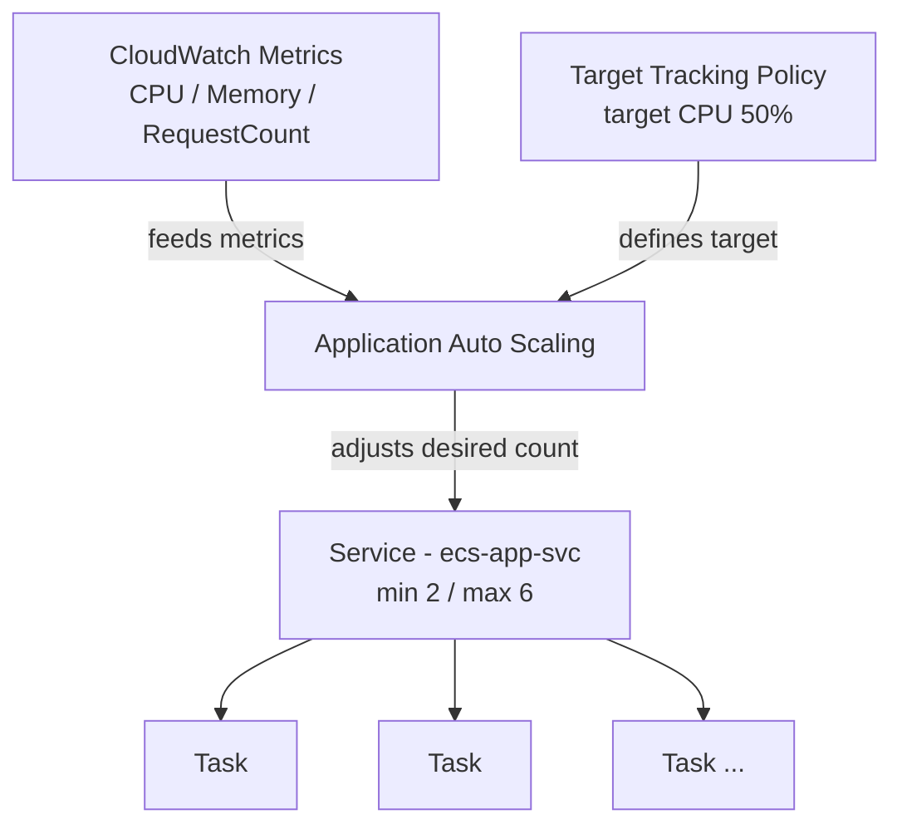
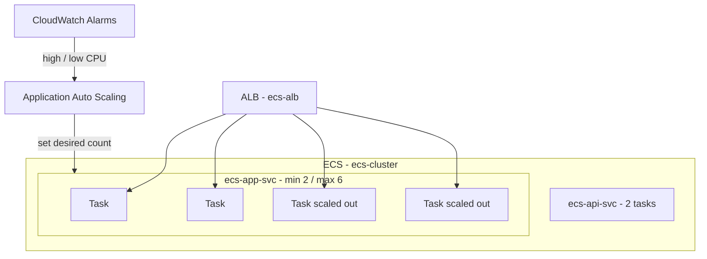

# Chapter 7 — Auto Scaling in ECS

Imagine this. It's a normal Tuesday afternoon, your Streamlit app is humming along on two Fargate tasks, and someone in marketing decides to post your link in a newsletter that goes out to forty thousand people. Traffic triples in about ninety seconds. Your two tasks start choking, response times crawl, and you're frantically clicking "Update service" to bump the desired count while the spike is already happening.

Then the opposite problem. It's 3 AM, almost nobody is using the app, and those same two tasks are sitting there doing nothing, billing you the whole time.

Fixed task counts are a guess. Sometimes the guess is too low and you fall over. Sometimes it's too high and you waste money. This chapter fixes that by letting ECS adjust the task count on its own, based on what's actually happening.

**Region:** `eu-north-1` (or your preferred region)
**Launch type:** Fargate
**Inherited from Chapters 2–6:** `ecs-cluster`, `ecs-app-svc` (2 tasks), `ecs-api-svc` (2 tasks), ALB `ecs-alb`, target group `ecs-tg`

---

## What You'll Learn

- How ECS service auto scaling actually works (and how it's different from EC2 Auto Scaling Groups)
- What a scalable target is, and why min/max matter more than people think
- Target tracking policies — the "set a thermostat and walk away" approach
- Step scaling — for when you want manual control over the steps
- Scaling on custom metrics, like queue depth
- How to add scaling to your existing `ecs-app-svc` without touching anything else

---

## Theory: How Scaling Works in ECS

### It's not the same thing as EC2 Auto Scaling

This trips up a lot of people, so let's clear it up first. When you hear "auto scaling" in AWS, your brain probably jumps to EC2 Auto Scaling Groups — adding and removing virtual machines. That's a different service.

ECS service scaling uses **AWS Application Auto Scaling**. It doesn't add servers. On Fargate there are no servers for you to add anyway. What it changes is the **desired count** of your service — how many tasks ECS keeps running. You say "I want between 2 and 6 tasks," and Application Auto Scaling moves that number up and down for you.

> Think of it like a thermostat for your service. You don't manually turn the heat on and off all night. You set a target temperature and the thermostat does the work. Here, the "temperature" is something like average CPU.

### The scalable target

Before any policy can do anything, you register a **scalable target**. That's just a fancy way of saying "here are the boundaries." For `ecs-app-svc`, we'll set a minimum of 2 and a maximum of 6.

The minimum is your safety floor — even at 3 AM you never drop below this. The maximum is your cost ceiling and your blast-radius limit. Set the max too low and a real spike still knocks you over. Set it absurdly high and a runaway loop (or a bad load test) can scale you into a surprise bill. Pick a number you'd be comfortable paying for.

### Target tracking — the easy one

**Target tracking** is the policy you'll reach for ninety percent of the time. You pick a metric and a target value, and ECS does the math. "Keep average CPU around 50%." If CPU climbs above that, it adds tasks. If it falls below, it removes them. AWS even creates the CloudWatch alarms behind the scenes for you.

The three built-in metrics are:

| Metric | When to use it |
|---|---|
| `ECSServiceAverageCPUUtilization` | App is CPU-bound (most web apps) |
| `ECSServiceAverageMemoryUtilization` | App is memory-bound |
| `ALBRequestCountPerTarget` | You care about requests-per-task, not raw CPU |

That last one is a quiet favourite. CPU can lag behind a traffic spike, but request count reacts the moment the requests arrive.

### Step scaling — the manual gearbox

**Step scaling** hands you the steering wheel. You define CloudWatch alarms and the exact steps: "if CPU is over 70%, add 1 task; if it's over 90%, add 3." It's more work and more knobs, but it's handy when target tracking's smooth curve isn't aggressive enough for sudden, sharp spikes.

> Target tracking is cruise control. Step scaling is shifting gears yourself. Most days cruise control is fine.

### Custom metrics

You're not stuck with CPU and memory. If your API pulls jobs off an SQS queue, the number that actually matters is queue depth, not CPU. You can publish any metric to CloudWatch and scale on it — for example, add a task for every 100 messages waiting. The mechanics are identical; you just point the policy at your own metric.

### A word on cooldowns

Scaling isn't instant, and you don't want it twitchy. **Cooldown** periods stop ECS from flapping — adding tasks, removing them, adding them again. Scale-out is usually quick and eager. Scale-in is deliberately slower and more cautious, because dropping a task at the wrong moment hurts more than keeping one too long.

### How it fits together



---

## Hands-On: Add Scaling to `ecs-app-svc`

We're not building anything new here. We're attaching scaling policies to the Streamlit service that's already running.

### Prerequisites

> This is an ECS series. We assume `ecs-cluster`, `ecs-app-svc` (2/2 tasks), the ALB `ecs-alb`, and target group `ecs-tg` are all in place from earlier chapters.

You'll need:

- `ecs-app-svc` running on `ecs-cluster`
- Permissions for Application Auto Scaling and CloudWatch

---

### Step 1 — Open the service auto scaling settings

1. Go to **ECS Console** → **Clusters** → `ecs-cluster` → **Services** → `ecs-app-svc`.
2. Click **Update service**.
3. Scroll to **Service auto scaling** and turn it on.

| Setting | Value |
|---|---|
| Minimum number of tasks | `2` |
| Desired number of tasks | `2` |
| Maximum number of tasks | `6` |

<!-- image placeholder: ecs-app-svc update page with service auto scaling enabled, min 2 / max 6 -->

That min/max pair is the scalable target. Everything else hangs off it.

---

### Step 2 — Add a CPU target tracking policy

Still on the same page, add a scaling policy:

| Setting | Value |
|---|---|
| Policy type | Target tracking |
| Policy name | `cpu-target-50` |
| ECS service metric | `ECSServiceAverageCPUUtilization` |
| Target value | `50` |
| Scale-out cooldown | `60` seconds |
| Scale-in cooldown | `120` seconds |

<!-- image placeholder: target tracking policy form with CPU metric and target value 50 -->

Save the service. ECS quietly creates two CloudWatch alarms — one for high CPU, one for low — and wires them to the policy. You don't manage those alarms by hand.

---

### Step 3 — Add a request-count policy (optional but worth it)

CPU is a good baseline, but request count reacts faster to traffic. Add a second target tracking policy:

| Setting | Value |
|---|---|
| Policy name | `requests-per-task` |
| Metric | `ALBRequestCountPerTarget` |
| Target value | `1000` (requests per task) |
| Resource label | `ecs-alb` / `ecs-tg` |

With two policies, Application Auto Scaling takes whichever one asks for more tasks. They cooperate — they don't fight.

---

### Step 4 — The same thing from the CLI

If you'd rather script it, here's the whole thing in two commands. First, register the scalable target:

```bash
aws application-autoscaling register-scalable-target \
  --service-namespace ecs \
  --scalable-dimension ecs:service:DesiredCount \
  --resource-id service/ecs-cluster/ecs-app-svc \
  --min-capacity 2 \
  --max-capacity 6 \
  --region eu-north-1
```

Then attach the CPU policy:

```bash
aws application-autoscaling put-scaling-policy \
  --service-namespace ecs \
  --scalable-dimension ecs:service:DesiredCount \
  --resource-id service/ecs-cluster/ecs-app-svc \
  --policy-name cpu-target-50 \
  --policy-type TargetTrackingScaling \
  --target-tracking-scaling-policy-configuration '{
    "TargetValue": 50.0,
    "PredefinedMetricSpecification": {
      "PredefinedMetricType": "ECSServiceAverageCPUUtilization"
    },
    "ScaleOutCooldown": 60,
    "ScaleInCooldown": 120
  }' \
  --region eu-north-1
```

---

### Step 5 — Watch it actually scale

Settings are nice, but you want to see it work. Generate some load against the ALB URL — a quick `hey` or `ab` run, or just hammer it from a loop:

```bash
hey -z 3m -c 50 http://<ecs-alb-dns>/
```

Then watch:

1. **Service → Events tab** — you'll see lines like "Successfully set desired count to 4. Reason: monitor alarm ...". This is the first place to look.
2. **Service → Health and metrics** — CPU climbs, task count steps up behind it.
3. **CloudWatch → Alarms** — the alarms ECS created flip to *In alarm* during the spike.

<!-- image placeholder: ecs-app-svc Events tab showing desired count raised from 2 to 4 -->

When the load stops, give it a few minutes. Scale-in is slow on purpose, so don't panic if it doesn't drop back to 2 the instant traffic dies.

Here's the gotcha that catches people: if your tasks never go above 50% CPU during the test, nothing scales, and you'll swear it's broken. It isn't. Either push more load or lower the target temporarily to prove it to yourself.

---

## Architecture After Chapter 7



---

## Key Takeaways

- ECS service scaling changes the **desired task count**, not servers — it runs on Application Auto Scaling, not EC2 ASGs.
- A **scalable target** sets your min/max. The min is your safety floor; the max is your cost ceiling.
- **Target tracking** is the default choice — pick a metric, set a target, walk away.
- **Step scaling** and **custom metrics** are there when you outgrow the simple case.
- Cooldowns keep scaling calm: quick to scale out, slow to scale in.

---

## What's Next

Your service now grows and shrinks with traffic on its own. But every deploy is still a manual chore — build the image, push it, create a new task definition revision, click Update service, and hope. In **Chapter 8 — CI/CD for ECS**, we automate the whole release with GitHub Actions: build, push to ECR, and roll out a new revision without anyone touching the console.

See you in the next chapter.
