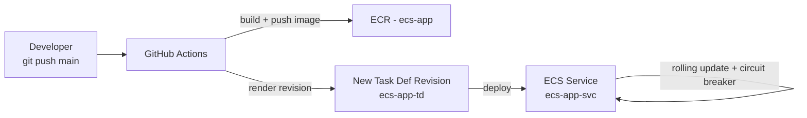
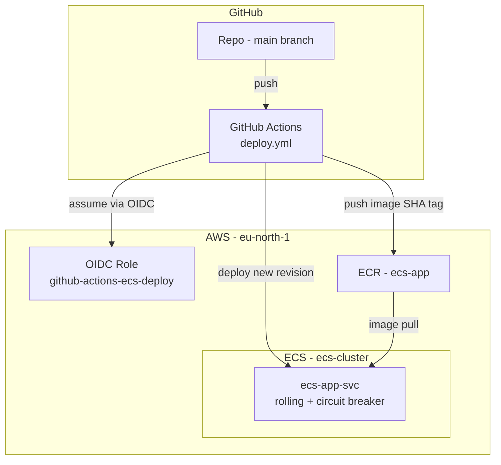

# Chapter 8 — CI/CD for ECS

There's a moment in every project where manual deploys stop being a minor annoyance and become a genuine risk. For us, that moment is now. Up to this point every release in this series has been hand-cranked: build the image locally, tag it, push to ECR, open the console, cut a new task definition revision, paste the new image URI, click Update service. It works when one person does it carefully on a quiet afternoon. It breaks the day someone does it at 6 PM on a Friday under pressure.

I've watched a teammate deploy a revision still pointing at the previous image tag and lose half an hour to "why isn't my change live." That's not a discipline problem you can train away. It's a process problem, and the fix is to remove the human from the mechanical parts entirely. In this chapter we build a GitHub Actions pipeline so that a push to `main` results in a live deployment on `ecs-app-svc` — same image build, same revision bump, same rollout, done identically every time.

**Region:** `eu-north-1` (or your preferred region)
**Launch type:** Fargate
**Inherited from Chapters 2–7:** `ecs-cluster`, `ecs-app-svc`, task definition `ecs-app-td`, ECR repo `ecs-app`, auto scaling from Chapter 7

---

## What You'll Learn

- The four stages that every ECS deployment pipeline reduces to, no matter the tooling
- How GitHub authenticates to AWS with short-lived OIDC tokens instead of stored keys
- How to build, tag, and push an image to the existing `ecs-app` repo
- How to render a new task definition revision and roll it out to a running service
- How the deployment circuit breaker turns a failed release into a non-event

---

## Theory: What a Pipeline Actually Does

### Four stages, regardless of tooling

Whether you use GitHub Actions, GitLab CI, or CodePipeline, an ECS deployment is always the same four moves:

| Stage | What happens |
|---|---|
| **Build** | Compile the code into a container image |
| **Push** | Store that image in ECR under a unique tag |
| **Render** | Take the existing task definition and substitute the new image URI |
| **Deploy** | Register the new revision and update the service to use it |

The value of a pipeline isn't a better deploy. It's an *identical* deploy, every time, with no steps skipped because someone was distracted. Consistency is the feature.

> An assembly line doesn't build a finer chair than a craftsman. It builds the same chair a thousand times without variation. For deployments, sameness is exactly what you're buying.

### Authentication: stop storing keys

Here's where I see the most security debt accumulate. The path of least resistance is to mint an IAM access key and paste it into GitHub secrets. Resist it. Long-lived credentials in CI are the thing that turns up in post-incident reviews — they don't rotate, they outlive the people who created them, and a single repo compromise hands an attacker standing access to your account.

The correct approach is **OpenID Connect (OIDC)**. You establish a one-time trust relationship: AWS agrees to accept short-lived tokens minted by GitHub's identity provider, but only for a specific repository and branch. At deploy time GitHub requests a token, AWS validates its claims, and issues temporary credentials that expire on their own. Nothing long-lived is ever stored.

> OIDC is a visitor badge printed for a single visit that stops working the moment you leave the building, versus a permanent key that floats around the office forever.

### Tag with the commit SHA

A small convention that pays off during every incident: tag images with the Git commit SHA, not `latest`. When production misbehaves, `ecs-app:8f3a1c9` points at the exact commit running, and rollback becomes "deploy the previous SHA" instead of an archaeology project. `latest` is a moving target that tells you nothing under pressure.

### Rollback should be automatic

ECS ships a **deployment circuit breaker**. Switch it on and ECS watches the new tasks during a rollout; if they fail health checks, it stops the deployment, abandons the bad revision, and restores the last working one — no human, no page. This is the difference between a broken deploy that self-corrects in minutes and one that becomes an outage.

### The flow end to end



---

## Hands-On: A Working Pipeline for `ecs-app-svc`

We reuse the existing ECR repo, cluster, and service. The only thing created in AWS is one IAM role for GitHub to assume.

### Prerequisites

> This is an ECS series. We assume `ecs-cluster`, `ecs-app-svc`, task definition `ecs-app-td`, and ECR repo `ecs-app` already exist, and that your application code lives in a GitHub repo with a `Dockerfile`.

---

### Step 1 — Create the GitHub OIDC role

1. In the **IAM Console**, add an **Identity provider**: type OIDC, URL `https://token.actions.githubusercontent.com`, audience `sts.amazonaws.com`.
2. Create a role that trusts that provider and is scoped tightly to your repository:

```json
{
  "Effect": "Allow",
  "Principal": {
    "Federated": "arn:aws:iam::ACCOUNT_ID:oidc-provider/token.actions.githubusercontent.com"
  },
  "Action": "sts:AssumeRoleWithWebIdentity",
  "Condition": {
    "StringEquals": {
      "token.actions.githubusercontent.com:aud": "sts.amazonaws.com"
    },
    "StringLike": {
      "token.actions.githubusercontent.com:sub": "repo:YOUR_ORG/YOUR_REPO:ref:refs/heads/main"
    }
  }
}
```

3. Attach permissions for ECR push, ECS update, and `iam:PassRole` for `ecsTaskExecutionRole`. Grant only what the pipeline needs — this role is a standing target, so scope it as narrowly as the deploy allows. Name it `github-actions-ecs-deploy` and copy the ARN.

<!-- image placeholder: IAM role github-actions-ecs-deploy trust policy scoped to the repo -->

> The `sub` condition is the line that matters. Drop it and you've trusted every repository on GitHub. Keep it and only pushes to `main` in your repo can assume the role.

---

### Step 2 — Commit the base task definition

The pipeline edits a known-good task definition rather than inventing one. Export the current one and commit it at `.aws/task-definition.json`:

```bash
aws ecs describe-task-definition \
  --task-definition ecs-app-td \
  --query taskDefinition \
  --region eu-north-1 > .aws/task-definition.json
```

Strip the read-only fields AWS adds (`taskDefinitionArn`, `revision`, `status`, `requiresAttributes`, `registeredAt`, `registeredBy`) so the file registers without errors.

---

### Step 3 — Write the workflow

Create `.github/workflows/deploy.yml`:

```yaml
name: Deploy to ECS

on:
  push:
    branches: [main]

permissions:
  id-token: write   # required for OIDC
  contents: read

env:
  AWS_REGION: eu-north-1
  ECR_REPOSITORY: ecs-app
  ECS_CLUSTER: ecs-cluster
  ECS_SERVICE: ecs-app-svc
  CONTAINER_NAME: app

jobs:
  deploy:
    runs-on: ubuntu-latest
    steps:
      - name: Checkout
        uses: actions/checkout@v4

      - name: Configure AWS credentials
        uses: aws-actions/configure-aws-credentials@v4
        with:
          role-to-assume: arn:aws:iam::ACCOUNT_ID:role/github-actions-ecs-deploy
          aws-region: ${{ env.AWS_REGION }}

      - name: Log in to Amazon ECR
        id: login-ecr
        uses: aws-actions/amazon-ecr-login@v2

      - name: Build and push image
        id: build
        env:
          REGISTRY: ${{ steps.login-ecr.outputs.registry }}
          TAG: ${{ github.sha }}
        run: |
          docker build -t $REGISTRY/$ECR_REPOSITORY:$TAG .
          docker push $REGISTRY/$ECR_REPOSITORY:$TAG
          echo "image=$REGISTRY/$ECR_REPOSITORY:$TAG" >> $GITHUB_OUTPUT

      - name: Render new task definition
        id: render
        uses: aws-actions/amazon-ecs-render-task-definition@v1
        with:
          task-definition: .aws/task-definition.json
          container-name: ${{ env.CONTAINER_NAME }}
          image: ${{ steps.build.outputs.image }}

      - name: Deploy to ECS
        uses: aws-actions/amazon-ecs-deploy-task-definition@v2
        with:
          task-definition: ${{ steps.render.outputs.task-definition }}
          service: ${{ env.ECS_SERVICE }}
          cluster: ${{ env.ECS_CLUSTER }}
          wait-for-service-stability: true
```

Each step maps to one of the four stages: ECR login, build and push tagged with the commit SHA, render the task definition with the new image, then register and deploy. The line I never omit is `wait-for-service-stability: true` — without it the job goes green the instant the API call returns, long before the rollout is actually healthy. With it, the pipeline fails loudly when a deploy doesn't stabilise, which is what you want CI to do.

---

### Step 4 — Turn on the circuit breaker

Enable automatic rollback once, on the service:

```bash
aws ecs update-service \
  --cluster ecs-cluster \
  --service ecs-app-svc \
  --deployment-configuration '{
    "deploymentCircuitBreaker": { "enable": true, "rollback": true }
  }' \
  --region eu-north-1
```

From now on, if new tasks can't pass health checks, ECS abandons them and restores the last good revision on its own.

---

### Step 5 — Ship a change and watch it land

Make a small, visible change, commit, and push:

```bash
git commit -am "Pipeline test: update homepage text"
git push origin main
```

Watch both systems:

1. **GitHub → Actions tab** — the job moves through build, push, render, deploy.
2. **ECS Console → `ecs-app-svc` → Deployments** — a new rollout appears, old tasks drain, new ones come up.
3. **Service → Events** — confirms the new revision registered and reached steady state.

<!-- image placeholder: GitHub Actions run showing all deploy steps green -->
<!-- image placeholder: ecs-app-svc Deployments tab with the new revision rolling out -->

When the ALB URL reflects your change, the loop is closed and deploying is just `git push` from here on.

The failure you'll almost certainly hit on the first run is a `PassRole` error: your deploy role can register a task definition but isn't allowed to pass `ecsTaskExecutionRole` to ECS. Add `iam:PassRole` scoped to that role and it clears. It's the single most common first-time stumble, and now you won't lose an hour to it.

---

## Architecture After Chapter 8



---

## Key Takeaways

- Every ECS pipeline reduces to four stages — **build, push, render, deploy** — and the win is doing them identically every time.
- Use **OIDC**, never stored access keys: short-lived tokens scoped to one repo and branch.
- Tag images with the **commit SHA** so you always know what's running and can roll back deterministically.
- The **deployment circuit breaker** makes failed releases self-correct instead of paging someone.
- Scope the deploy role narrowly and expect the `PassRole` error on first run.

---

## What's Next

The core ECS journey is now complete. You have a cluster, services that find each other, a load balancer, managed secrets, capacity that tracks demand, and releases that ship themselves. The chapters ahead build on this same `ecs-cluster` foundation, moving into the operational concerns that come after you're shipping with confidence — observability, cost control, and production hardening.

You don't deploy by hand anymore. That's the right place to end up.
