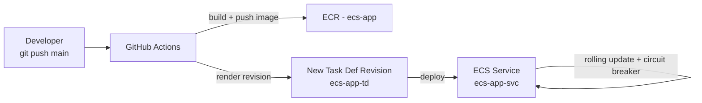
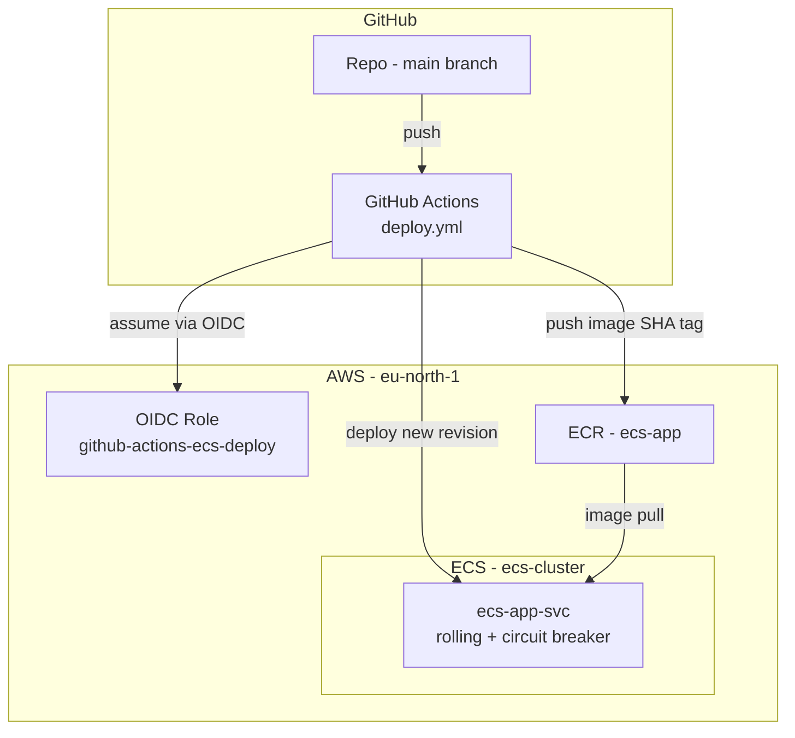

# Chapter 8 — CI/CD for ECS

Let's be honest about how the deploys have gone so far in this series. You build the image on your laptop, tag it, push it to ECR, open the ECS console, create a new task definition revision, paste in the new image URI, then click Update service and watch the tasks roll over. It works. But it's a chore, and it's exactly the kind of repetitive, fiddly job where a tired human eventually pastes the wrong tag at the wrong time.

I've done that. Pushed `v3` to ECR, then deployed the task definition still pointing at `v2`, and spent twenty minutes confused about why my change wasn't showing up. The fix isn't being more careful. The fix is to stop doing it by hand.

In this chapter we wire up a GitHub Actions pipeline. Push to `main`, and a few minutes later your change is live on `ecs-app-svc` — no console, no copy-paste, no wrong tags.

**Region:** `eu-north-1` (or your preferred region)
**Launch type:** Fargate
**Inherited from Chapters 2–7:** `ecs-cluster`, `ecs-app-svc`, task definition `ecs-app-td`, ECR repo `ecs-app`, auto scaling from Chapter 7

---

## What You'll Learn

- The four stages every ECS pipeline boils down to
- How GitHub talks to AWS without you storing a single access key (OIDC)
- How to build and push an image to your existing `ecs-app` repo
- How to render a fresh task definition revision and deploy it
- How the deployment circuit breaker rolls a bad release back for you

---

## Theory: What a Pipeline Actually Does

### Four stages, that's it

Strip away the YAML and every ECS deployment pipeline is the same four moves:

| Stage | What happens |
|---|---|
| **Build** | Turn your code into a Docker image |
| **Push** | Send that image to ECR with a unique tag |
| **Render** | Take the current task definition and swap in the new image URI |
| **Deploy** | Tell ECS to roll the service over to the new revision |

That's the whole story. GitHub Actions just does each step in order, the same way every time, without getting bored or distracted.

> Think of it like an assembly line versus building a chair by hand each morning. The line doesn't make a better chair. It makes the *same* chair every single time, which is exactly what you want for deploys.

### The credentials problem (and OIDC)

Here's the part people get wrong first. To deploy, GitHub needs permission to push to ECR and update ECS. The lazy way is to generate an AWS access key and paste it into GitHub secrets. Don't. Static keys leak, they sit there forever, and rotating them is a job nobody remembers to do.

The better way is **OpenID Connect (OIDC)**. You set up a trust relationship once: AWS agrees to trust short-lived tokens that GitHub hands out, but only for your specific repository. At deploy time, GitHub requests a temporary token, AWS checks it came from the right repo, and grants a session that expires on its own. No long-lived secret anywhere.

> OIDC is like a visitor badge that's printed fresh for each visit and stops working when you leave — instead of cutting a permanent key that floats around forever.

### Tags matter

A small habit that saves real pain: tag images with the Git commit SHA, not just `latest`. When something breaks in production, `ecs-app:8f3a1c9` tells you exactly which commit is running. `latest` tells you nothing and makes rollbacks a guessing game.

### Rollback for free

ECS has a **deployment circuit breaker**. Turn it on, and if the new tasks fail their health checks during a rollout, ECS stops, gives up on the bad revision, and puts the previous working one back — automatically. So a broken deploy becomes a non-event instead of a 2 AM page.

### The flow end to end



---

## Hands-On: A Working Pipeline for `ecs-app-svc`

We reuse the same ECR repo, cluster, and service from earlier chapters. Nothing new gets created in AWS except one IAM role for GitHub to assume.

### Prerequisites

> This is an ECS series. We assume `ecs-cluster`, `ecs-app-svc`, task definition `ecs-app-td`, and ECR repo `ecs-app` already exist. Your app code lives in a GitHub repo with a `Dockerfile`.

---

### Step 1 — Create the GitHub OIDC role in AWS

1. In the **IAM Console**, add an **Identity provider**: provider type OIDC, URL `https://token.actions.githubusercontent.com`, audience `sts.amazonaws.com`.
2. Create a role that trusts that provider, scoped to your repo so no other repo can assume it:

```json
{
  "Effect": "Allow",
  "Principal": {
    "Federated": "arn:aws:iam::ACCOUNT_ID:oidc-provider/token.actions.githubusercontent.com"
  },
  "Action": "sts:AssumeRoleWithWebIdentity",
  "Condition": {
    "StringEquals": {
      "token.actions.githubusercontent.com:aud": "sts.amazonaws.com"
    },
    "StringLike": {
      "token.actions.githubusercontent.com:sub": "repo:YOUR_ORG/YOUR_REPO:ref:refs/heads/main"
    }
  }
}
```

3. Attach permissions for ECR push, ECS update, and `iam:PassRole` for `ecsTaskExecutionRole`. Call the role `github-actions-ecs-deploy` and copy its ARN.

<!-- image placeholder: IAM role github-actions-ecs-deploy trust policy scoped to the repo -->

> The `sub` condition is the important line. Without it, any GitHub repo on the internet could assume your role. With it, only pushes to `main` in your repo can.

---

### Step 2 — Save your task definition as a file

The pipeline needs a base task definition to edit. Pull the current one and commit it to your repo at `.aws/task-definition.json`:

```bash
aws ecs describe-task-definition \
  --task-definition ecs-app-td \
  --query taskDefinition \
  --region eu-north-1 > .aws/task-definition.json
```

Trim the read-only fields AWS adds (`taskDefinitionArn`, `revision`, `status`, `requiresAttributes`, `registeredAt`, `registeredBy`) so the file registers cleanly.

---

### Step 3 — Write the workflow

Create `.github/workflows/deploy.yml`:

```yaml
name: Deploy to ECS

on:
  push:
    branches: [main]

permissions:
  id-token: write   # required for OIDC
  contents: read

env:
  AWS_REGION: eu-north-1
  ECR_REPOSITORY: ecs-app
  ECS_CLUSTER: ecs-cluster
  ECS_SERVICE: ecs-app-svc
  CONTAINER_NAME: app

jobs:
  deploy:
    runs-on: ubuntu-latest
    steps:
      - name: Checkout
        uses: actions/checkout@v4

      - name: Configure AWS credentials
        uses: aws-actions/configure-aws-credentials@v4
        with:
          role-to-assume: arn:aws:iam::ACCOUNT_ID:role/github-actions-ecs-deploy
          aws-region: ${{ env.AWS_REGION }}

      - name: Log in to Amazon ECR
        id: login-ecr
        uses: aws-actions/amazon-ecr-login@v2

      - name: Build and push image
        id: build
        env:
          REGISTRY: ${{ steps.login-ecr.outputs.registry }}
          TAG: ${{ github.sha }}
        run: |
          docker build -t $REGISTRY/$ECR_REPOSITORY:$TAG .
          docker push $REGISTRY/$ECR_REPOSITORY:$TAG
          echo "image=$REGISTRY/$ECR_REPOSITORY:$TAG" >> $GITHUB_OUTPUT

      - name: Render new task definition
        id: render
        uses: aws-actions/amazon-ecs-render-task-definition@v1
        with:
          task-definition: .aws/task-definition.json
          container-name: ${{ env.CONTAINER_NAME }}
          image: ${{ steps.build.outputs.image }}

      - name: Deploy to ECS
        uses: aws-actions/amazon-ecs-deploy-task-definition@v2
        with:
          task-definition: ${{ steps.render.outputs.task-definition }}
          service: ${{ env.ECS_SERVICE }}
          cluster: ${{ env.ECS_CLUSTER }}
          wait-for-service-stability: true
```

Walk through what each step does: log in to ECR, build and push the image tagged with the commit SHA, rewrite the task definition with that new image, then register the revision and update the service. The `wait-for-service-stability: true` line is the one I'd never skip — it makes the job fail loudly if the rollout doesn't go healthy, instead of going green on a broken deploy.

---

### Step 4 — Turn on the circuit breaker

So a bad image rolls itself back, update the service once to enable it:

```bash
aws ecs update-service \
  --cluster ecs-cluster \
  --service ecs-app-svc \
  --deployment-configuration '{
    "deploymentCircuitBreaker": { "enable": true, "rollback": true }
  }' \
  --region eu-north-1
```

Now if new tasks can't pass health checks, ECS abandons them and restores the last good revision on its own.

---

### Step 5 — Ship something and watch it go

Make a small visible change, commit, and push to `main`:

```bash
git commit -am "Pipeline test: update homepage text"
git push origin main
```

Then watch both ends:

1. **GitHub → Actions tab** — the job runs through build, push, render, deploy.
2. **ECS Console → `ecs-app-svc` → Deployments** — a new rollout appears, old tasks drain, new ones come up.
3. **Service → Events** — confirms the new task definition revision registered and reached a steady state.

<!-- image placeholder: GitHub Actions run showing all deploy steps green -->
<!-- image placeholder: ecs-app-svc Deployments tab with the new revision rolling out -->

When the ALB URL shows your change, the loop is closed. From here on, deploying is just `git push`.

The gotcha worth flagging: if the job fails on `PassRole`, your IAM role can't pass `ecsTaskExecutionRole` to ECS. Add `iam:PassRole` for that role and you're good. It's the single most common first-run failure.

---

## Architecture After Chapter 8



---

## Key Takeaways

- Every ECS pipeline is four stages: **build, push, render, deploy**.
- Use **OIDC**, not stored access keys — short-lived tokens scoped to your repo.
- Tag images with the **commit SHA** so you always know what's running and can roll back with confidence.
- The **deployment circuit breaker** turns a broken release into a non-event by rolling back on its own.
- Once it's wired up, shipping is just `git push origin main`.

---

## What's Next

The core ECS journey is done — you've got a cluster, services that talk to each other, a load balancer, secrets, auto scaling, and now hands-off deployments. The chapters ahead build on this same `ecs-cluster` foundation, moving into observability, cost, and the production-hardening topics that come after you're shipping confidently.

You no longer deploy by hand. That's a good place to be.
