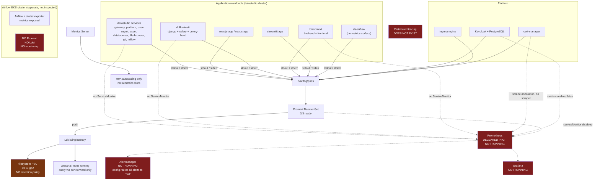
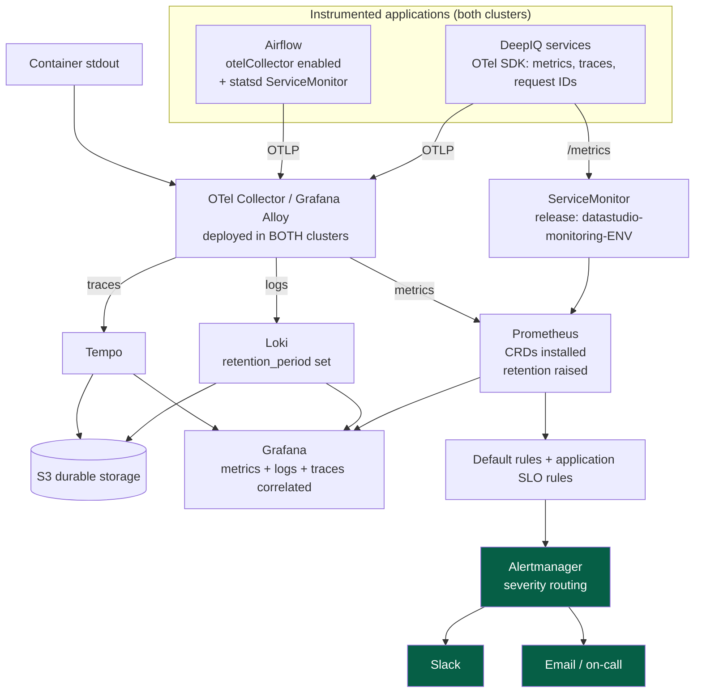

# Observability Current-State Survey

**Scope:** DeepIQ datastudio EKS cluster (inspected) + helm-gitops repository

**Date:** 19 August 2026

**Status:** Draft for review with @gvishnu

**Purpose:** Establish current observability coverage, identify gaps, recommend a tooling direction.

---

# 1. Executive Summary

**Application metrics, alerting, and distributed tracing are not currently available in the inspected cluster.**

Container logs flow end to end: Promtail (DaemonSet, 3/3 ready) ships to Loki. That path is intact, though Loki has no retention policy and no durable storage.

Nothing else collects anything:

- No Prometheus, Alertmanager, or Grafana pod is running in the inspected cluster.
- The Prometheus Operator CRDs are not installed -- the API has no `servicemonitor` resource type.
- No distributed tracing backend, collector, or instrumentation was identified in the inspected cluster or repository. No Tempo, Jaeger, or OpenTelemetry deployment.
- No application metrics endpoint or collection configuration was identified in the inspected GitOps repository, and no application chart defines a ServiceMonitor.

**This is not a tooling-selection problem.** The repository already contains a complete, vendored kube-prometheus-stack v70.2.1 -- Prometheus, Alertmanager, Grafana (already wired to Keycloak SSO), kube-state-metrics, node-exporter -- at `multi-tenant-cluster-apps/multi-tenant-init-apps/monitoring/`. The ArgoCD ApplicationSet that deploys the other init apps covers it by directory glob, so it should be deploying. It is not.

A confirmed contributing cause is the following configuration: `monitoring/values.yaml:34` sets `crds.enabled: false`. Without the CRDs, the operator cannot create Prometheus or Alertmanager resources, which matches the missing `servicemonitor` resource type exactly. That does not explain every absence (Section 4), so the delivery question needs one check in ArgoCD before any fix is attempted.

Three further defects sit latent in the committed configuration and will bite the day the stack does come up:

| Latent defect | Evidence | Effect once deployed |
|---|---|---|
| Alertmanager routes every alert to a receiver named `null` | `monitoring/values.yaml:531-542` | All alerts silently discarded |
| ServiceMonitor discovery label does not match the release name | `monitoring/values.yaml:4090` vs `multi-tenant-datastudio-appsets/values.yaml` | Any monitor added is invisible to Prometheus |
| Annotation-based scraping disabled | `monitoring/values.yaml:4321` | Every `prometheus.io/scrape` annotation in the repo is inert |

**Separately: the Airflow cluster has no log collection at all.** It is a second EKS cluster with its own app tree, and `airflow_cluster_apps/airflow-init-setup/` contains no Promtail, no Loki, and no monitoring (Section 7).

**Recommended direction:** consolidate on the self-hosted stack already chosen and committed (Section 11). The work is delivery and configuration, not procurement.

---

# 2. Evidence and Method

Two sources, deliberately kept distinct:

| Source | Establishes | Limits |
|---|---|---|
| Live `kubectl` against the datastudio EKS cluster | What is **running** | One cluster, one point in time |
| helm-gitops repository, `dev` branch | What is **declared** | Declared is not running -- ArgoCD may not have applied it |

Rules applied:

- Repository claims cite `path:line`.
- Cluster claims show the command that produced them.
- Where declared and running disagree, both are stated and the gap is the finding.
- Runtime or framework read from an image name is marked *(inferred)*.

**Not inspected, and therefore not covered by this survey:**

- **The Airflow EKS cluster** (`FE7EDD...`) -- a separate cluster with its own ApplicationSets. Only the datastudio cluster (`C8345F...`) was inspected.
- **QA and production.** This survey covers the `dev` branch configuration and the dev cluster only.
- **Application source code.** Logging libraries, log formats, and request-ID propagation live in the service repositories, not here (Section 6.1).

---

# 3. What Is Actually Running

## 3.1 Present

```
kubectl get daemonset -n promtail
  datastudio-promtail-dev    3/3/3 ready    grafana/promtail:3.0.0

kubectl get statefulset -n loki
  datastudio-loki-dev        grafana/loki:3.4.2
  PVC 10Gi, storageClass gp2, object_store filesystem, chunks at /var/loki/chunks

kubectl get pods -n kube-system
  metrics-server-7b478c6458-rp96q
```

Platform components observed: AWS VPC CNI, CoreDNS, kube-proxy, EBS CSI, EFS CSI, Metrics Server, ingress-nginx, cert-manager, External DNS, External Secrets, Keycloak.

## 3.2 Absent

```
kubectl get pods -A | grep -Ei 'prometheus|alertmanager|grafana'
  (no output)

kubectl get servicemonitor,podmonitor -A
  error: the server doesn't have a resource type "servicemonitor"

kubectl get pods -A | grep -Ei 'tempo|jaeger|opentelemetry|otel'
  (no output)
```

The first grep would also have matched `prometheus-node-exporter` and the operator pod. Nothing matched at all, so the absence covers the entire kube-prometheus-stack, not only its CRD-dependent parts.

**Scope limitation:** this establishes that these components were not detected in *this* cluster through *this* context. It is not proof that no Prometheus, Grafana, or Alertmanager exists elsewhere -- another cluster, another account, or a managed service. Section 12 carries that as an open question.

---

# 4. Why the Monitoring Stack Is Absent

The repository says it should be running.

`multi-tenant-datastudio-appsets/templates/multi-tenant-init-setup.yaml` uses an ArgoCD git **directory generator** over `multi-tenant-cluster-apps/multi-tenant-init-apps/*`. Every subdirectory becomes an Application named `datastudio-<dirname>-<env>`, in a namespace equal to the directory name, with `automated` sync, `prune: true`, `selfHeal: true`.

`monitoring/` sits in that directory alongside `loki/` and `promtail/`, on the `dev` branch since commit `4104290` (25 May 2026). Loki and Promtail are running under exactly the names that generator produces. Monitoring is not.

## 4.1 Confirmed contributing cause

`monitoring/values.yaml:34`

```yaml
crds:
  enabled: false
```

kube-prometheus-stack ships the Prometheus, Alertmanager, ServiceMonitor, PodMonitor, and PrometheusRule CRDs in a subchart gated on this flag. With it off, the CRDs never install. Without them the Prometheus Operator cannot create the `Prometheus` or `Alertmanager` custom resources, so no pods appear.

This matches the observed `error: the server doesn't have a resource type "servicemonitor"` precisely.

## 4.2 What it does not explain

Grafana, kube-state-metrics, and node-exporter are ordinary Deployments and DaemonSets that need no CRDs. They should be running regardless. They are not.

So `crds.enabled: false` is necessary but not sufficient: the whole Application appears not to be reconciling.

## 4.3 The one check that settles it

From the cluster where **ArgoCD** runs -- not the target cluster:

```bash
argocd app get datastudio-monitoring-dev
```

Three possible answers, each pointing somewhere different:

| Result | Meaning |
|---|---|
| App missing | The ApplicationSet is not generating it; investigate the generator or the appset install |
| Present, Sync Failed | Likely the CRD size problem; kube-prometheus-stack CRDs are up to 778 KB each and the appset sets no `ServerSideApply=true` |
| Present, Synced, no pods | A rendering or values problem inside the chart |

Note the appset's `syncOptions` are only `CreateNamespace=true` and `ApplyOutOfSyncOnly=true`. Applying these CRDs client-side commonly fails on the annotation size limit, which makes the middle row the most likely.

**Nothing in Section 11 can be verified until this is resolved.** It is follow-up item 1.

---

# 5. Current-State Architecture

Solid lines carry data today. Dashed lines are declared in Git but produce nothing. Red is absent entirely.



**Reading it:** one signal works -- container logs into Loki. Metrics stop at Metrics Server, which only feeds autoscaling. Prometheus, Alertmanager, and Grafana are declared but not running. Traces do not exist. The Airflow cluster is outside the logging pipeline entirely.

---

# 6. Signal Coverage

## 6.1 Logs -- working, but not retained or durable

Path: pods -> stdout/stderr -> `/var/log/pods` -> Promtail DaemonSet -> Loki -> local PVC.

Promtail mounts `/var/log/pods` and `/var/lib/docker/containers`, config from Secret `datastudio-promtail-dev`, pushing to `http://datastudio-loki-dev.loki.svc.cluster.local:3100` (`promtail/values.yaml:425-430`).

Loki configuration:

| Setting | Value | Evidence |
|---|---|---|
| Deployment mode | SingleBinary | `loki/values.yaml:56` |
| Object store | filesystem | `loki/values.yaml:368` |
| Replication factor | 1 | `loki/values.yaml:357` |
| Persistence | 10 Gi, gp2 | `loki/values.yaml:1440-1445` |
| Retention | **not configured** | `loki/values.yaml:344-351` |
| Compactor | `{}` | `loki/values.yaml:523` |

Four problems:

1. **No retention.** `limits_config` sets `reject_old_samples`, `query_timeout`, and similar, but no `retention_period` and no `retention_enabled`. Nothing deletes old chunks.
2. **No durability.** Filesystem backend, replication factor 1, single PVC. Losing the volume loses all log history. The S3 configuration block exists and is empty (`loki/values.yaml:369-381`).
3. **Declared capacity is fiction.** `LOKI_STORAGE_SIZE: 200Gi` appears in four environment files -- `environments/defaults.yaml:29`, `dev/values.yaml:74`, `final-values.yaml:157`, `ms-values.yaml:79` -- and **no template consumes it**. The chart hardcodes 10 Gi. Anyone reading the environment files would conclude Loki has 200 Gi; it has 10 Gi. This is why the observed PVC is 10 Gi.
4. **The pipeline is unmonitored.** `promtail/values.yaml:270` -- `serviceMonitor.enabled: false`. If Promtail stops shipping, nothing notices; logs simply stop appearing. And no alert could fire anyway (Section 6.4).

**Not determinable from this repository:** logging libraries, structured vs plain text, and correlation IDs per service. No `LOG_FORMAT` or `LOG_LEVEL` variable appears in any application chart, and no request-ID propagation is configured anywhere. That last point matters most: without a correlation ID and without traces, following one request across gateway -> platform -> backend is manual timestamp matching. Completing this needs a pass over the service repositories.

## 6.2 Metrics -- nothing collected from applications

Metrics Server is running and serves the resource-metrics API used by HPAs. It is not a metrics store and holds no history.

Beyond that, nothing collects application metrics, for four reasons that compound. Even once Prometheus runs, causes B, C and D remain:

**A. Prometheus is not running** (Sections 3, 4).

**B. Nothing to discover.** No ServiceMonitor or PodMonitor exists in any application chart -- verified across `datastudio-dev/*` (18 charts), `multi-tenant-self-apps/*`, `customer/multi-tenant/3535353535/*`, and `customer/ri_tree/*`. The charts are minimal; `ds-gateway`, for instance, contains only `Chart.yaml`, `deployment.yaml`, `configmap.yaml`, and `horizantal.yaml`.

**C. The discovery label is wrong.** `monitoring/values.yaml:4090` sets `serviceMonitorSelectorNilUsesHelmValues: true` (likewise `:4113` PodMonitors, `:4065` rules), so Prometheus selects only objects labelled with its own release name -- `datastudio-monitoring-<env>`. But `multi-tenant-datastudio-appsets/values.yaml` declares:

```yaml
prometheus:
  servicemonitor:
    enabled: true
    labels:
      release: prometheus-stack
```

`prometheus-stack` is not the release name. A ServiceMonitor labelled this way exists, appears in `kubectl get servicemonitor`, and never produces a target. Silent failure.

**D. Annotation scraping is off.** `monitoring/values.yaml:4321` -- `additionalScrapeConfigs: []`. kube-prometheus-stack ignores `prometheus.io/scrape` annotations unless a scrape config is added. Every such annotation in the repo is therefore inert: Airflow statsd and pgbouncer, Keycloak's metrics service (`keycloak/values.yaml:1110`, and `metrics.enabled: false` at `:1093`), and cert-manager.

The cert-manager annotation found during the cluster sweep is an infrastructure component, not an application -- and given D, it is evidence of a path that looks configured and collects nothing.

**Missing signal for every DeepIQ service:** request rate, error rate, latency distribution, duration percentiles, in-flight requests, Celery queue depth, Celery task failure rate, DB connection pool state, job success and failure counts, and all business metrics.

When Prometheus does run, its retention is `10d` capped at `10GiB` on a 30 Gi volume (`monitoring/values.yaml:4181`, `:4185`, `:4286`) -- short, and two thirds of the disk unusable.

## 6.3 Traces -- do not exist

No tracing backend, no collector, no instrumentation. Repository-wide searches for `tempo`, `jaeger`, `opentelemetry`, `otel`, `traceparent`, and `OTEL_` return nothing outside the Airflow chart's disabled flags (Section 7).

Combined with the absence of a correlation ID (6.1), cross-service debugging today means aligning timestamps across separate log streams by hand. The cost scales with the number of hops and is worst during an incident.

## 6.4 Alerting -- no path exists, and a latent defect behind it

No Alertmanager is running, so there is no notification path of any kind today.

The committed configuration is also defective. `monitoring/values.yaml:531-542`:

```yaml
route:
  group_by: ['namespace']
  receiver: 'null'          # default route for every alert
  routes:
  - receiver: 'null'
    matchers:
      - alertname = "Watchdog"
receivers:
- name: 'null'              # the only receiver defined
```

This is the stock kube-prometheus-stack default, unmodified. Meanwhile `monitoring/values.yaml:168-200` enables the complete default rule set -- node pressure, disk exhaustion, pod crash-looping, API server latency, and dozens more -- with `appNamespacesTarget: ".*"`.

So the day the stack deploys successfully, every one of those alerts will fire into a receiver with no Slack, email, PagerDuty, or webhook configuration, and be discarded. Fixing the deployment without fixing this produces a monitoring stack that looks healthy and still tells nobody anything.

---

# 7. Airflow: Two Systems, Two Clusters

These are routinely conflated. They are unrelated.

| | `ds-airflow` | Airflow cluster chart |
|---|---|---|
| Path | `multi-tenant-cluster-apps/datastudio-dev/ds-airflow` | `customer/airflow-cluster/3535353535/airflow-3535353535` |
| Type | Hand-written Deployment | Official Airflow Helm chart |
| Cluster | datastudio (`C8345F...`) -- inspected | airflow (`FE7EDD...`) -- **not inspected** |
| Appset | `multi-tenant-datastudio-appsets` | `airflow-appsets` |
| Metrics surface | **None.** No statsd, no otel, no metrics config of any kind | statsd exporter enabled |

## 7.1 The datastudio `airflow-service`

Four templates: deployment, configmap, secret, azurefileshare. No metrics anything. Nothing to enable, nothing to scrape.

## 7.2 The Airflow cluster chart

| Setting | Line | Value |
|---|---|---|
| `statsd.enabled` | 3575 | `true` |
| `otelCollector.metricsEnabled` | 3693 | `false` |
| `otelCollector.tracesEnabled` | 3690 | `false` |

StatsD metrics are generated and converted to Prometheus format by the exporter, whose Service carries `prometheus.io/scrape: "true"` (`templates/statsd/statsd-service.yaml:38`). Nothing collects them: annotation scraping is off (6.2 D), and this chart version has **no ServiceMonitor template at all**. The previous version did -- `airflow-3535353535-v1/templates/webserver/webserver-service-monitor.yaml` -- so the capability regressed between chart versions.

The same chart offers OTel metrics and traces behind two booleans with an overridable collector config (`:3699-3713`). That is the cheapest tracing pilot available anywhere in the estate.

## 7.3 The Airflow cluster has no log collection

`airflow_cluster_apps/airflow-init-setup/` contains exactly four directories:

```
external-dns    ingress-nginx    metrics-server    post-init-chart
```

No Promtail. No Loki. No monitoring.

An entire cluster running scheduled data pipelines has **no centralized logging and no metrics collection**. Debugging a failed DAG there means `kubectl logs` against a pod that may already be gone. Of everything in this survey, this is the gap most likely to let a customer-visible failure pass unnoticed.

---

# 8. System Inventory

## 8.1 Clusters

| Cluster | Endpoint | Deployed by | Logs | Metrics | Inspected |
|---|---|---|---|---|---|
| datastudio | `C8345F...us-east-1.eks` | `multi-tenant-datastudio-appsets` | Promtail -> Loki | none | Yes |
| airflow | `FE7EDD...us-east-1.eks` | `airflow-appsets` | **none** | none | **No** |
| QA / production | unknown | unknown | unknown | unknown | **No** |

`environments/dev/values.yaml` also sets `CLOUD_PROVIDER: azure` with an `devds.azurecr.io` registry, so the estate spans both Azure and AWS. Any central backend must be reachable from both.

## 8.2 Application workloads (datastudio cluster)

Owner and criticality cannot be derived from the repository and are required by the issue. They are marked TBD so the gap is visible. **These need filling before the review.**

| Namespace | Workload | Runtime | Owner | Criticality | Logs | Metrics | Traces |
|---|---|---|---|---|---|---|---|
| datastudio | gateway-service | *(inferred)* | TBD | TBD | Loki | none | none |
| datastudio | platform-service | *(inferred)* | TBD | TBD | Loki | none | none |
| datastudio | user-management-service | *(inferred)* | TBD | TBD | Loki | none | none |
| datastudio | asset-hierarchy | *(inferred)* | TBD | TBD | Loki | none | none |
| datastudio | databrowser-service | *(inferred)* | TBD | TBD | Loki | none | none |
| datastudio | file-browser-service | *(inferred)* | TBD | TBD | Loki | none | none |
| datastudio | git-service | *(inferred)* | TBD | TBD | Loki | none | none |
| datastudio | metadata-dbservice | *(inferred)* | TBD | TBD | Loki | none | none |
| datastudio | mlflow | MLflow | TBD | TBD | Loki | none | none |
| datastudio | azure-databricks / cloud-vaults / apim | *(inferred)* | TBD | TBD | Loki | none | none |
| datastudio | reactjs-app | React *(inferred)* | TBD | TBD | Loki | none | none |
| datastudio | nextjs-app | Next.js *(inferred)* | TBD | TBD | Loki | none | none |
| datastudio | airflow-service (`ds-airflow`) | *(inferred)* | TBD | TBD | Loki | none (Section 7.1) | none |
| bizcontext | backend-service | *(inferred)* | TBD | TBD | Loki | none | none |
| bizcontext | frontend-service | *(inferred)* | TBD | TBD | Loki | none | none |
| drilluminatibackend | django / celery / celery-beat | Django + Celery *(inferred)* | TBD | TBD | Loki | none | none |
| drilluminatidemointernal | django / celery / celery-beat | Django + Celery *(inferred)* | TBD | TBD | Loki | none | none |
| streamlit-3535353535 | streamlitappdjango-service | Streamlit *(inferred)* | TBD | TBD | Loki | none | none |
| self-apps | deepsql, deepsql-celery, deepsql-flower, deepsql-dev-chat | *(inferred)* | TBD | TBD | Loki | none | none |

## 8.3 Airflow cluster workloads

| Workload | Owner | Criticality | Logs | Metrics | Traces |
|---|---|---|---|---|---|
| scheduler / webserver / workers / triggerer | TBD | TBD | **none** | exposed, not scraped | available, disabled |
| statsd exporter | TBD | TBD | **none** | exposed, not scraped | n/a |
| pgbouncer, postgresql, redis | TBD | TBD | **none** | exposed, not scraped | n/a |

## 8.4 Platform components

| Component | Source | Metrics state |
|---|---|---|
| Metrics Server | `multi-tenant-init-apps/metrics-server/` | resource API only, no history |
| Loki | `multi-tenant-init-apps/loki/` | exposes metrics; dashboards disabled (`:3609`) |
| Promtail | `multi-tenant-init-apps/promtail/` | exposes metrics; ServiceMonitor disabled (`:270`) |
| Keycloak + PostgreSQL | `multi-tenant-init-apps/keycloak/` | `metrics.enabled: false` (`:1093`) |
| ingress-nginx | `multi-tenant-init-apps/ingress-nginx/` | scrape annotations commented out (`:677`) |
| cert-manager | cluster | annotation present, no scraper |
| external-dns, external-secrets | init-apps | not monitored |
| VPC CNI, CoreDNS, kube-proxy, EBS/EFS CSI | EKS addons | not monitored |

---

## 9. Top Pain Points

Concrete production/incident examples were not available from the inspected
repository and cluster evidence. The following are current operational gaps
identified from the investigation:

1. No application error-rate or latency visibility.
2. No alert notification path.
3. No cross-service request correlation/tracing.
4. Airflow telemetry is exposed but not collected in the Airflow cluster.
5. Loki has limited local storage with no configured retention policy.

---

# 10. Gap Analysis

| Priority | Gap | Impact | Fix | Location |
|---|---|---|---|---|
| **P1** | Monitoring stack declared but not running | No metrics, no alerting, no dashboards | Diagnose in ArgoCD; set `crds.enabled: true`; likely add `ServerSideApply=true` | `monitoring/values.yaml:34`; init appset |
| **P1** | Airflow cluster has no log collection | Pipeline failures leave no durable trace | Deploy Promtail there, ship to central Loki | `airflow_cluster_apps/airflow-init-setup/` |
| **P1** | Alertmanager routes everything to `null` | No alert will reach anyone even once deployed | Define receivers and severity routes | `monitoring/values.yaml:531-542` |
| **P1** | Loki has no retention | Unbounded growth on a 10 Gi volume | Set `retention_period`, enable compactor retention | `loki/values.yaml:344-351` |
| **P1** | Loki not durable | Volume loss destroys all history | Configure S3 backend | `loki/values.yaml:369-381` |
| **P1** | No application metrics anywhere | Cannot measure error rate, latency, or traffic | Expose `/metrics`; add ServiceMonitors | app charts |
| **P2** | ServiceMonitor label mismatch | Monitors silently ignored | Set `release: datastudio-monitoring-<env>` | `multi-tenant-datastudio-appsets/values.yaml` |
| **P2** | Airflow metrics exposed but unscraped | DAG and task failures invisible | Add ServiceMonitor for the statsd exporter | Airflow chart |
| **P2** | No distributed tracing | Cross-service debugging is manual | Deploy Tempo; start with Airflow OTel traces | new `multi-tenant-init-apps/tempo/` |
| **P2** | No correlation or request ID | Cannot join logs across services | Define and propagate a request-ID header | service repos |
| **P2** | `LOKI_STORAGE_SIZE` is dead config | Declared 200 Gi, actual 10 Gi | Wire through or delete from all four files | `environments/*.yaml` |
| **P2** | Log pipeline unmonitored | Silent shipping failure | Enable Promtail ServiceMonitor | `promtail/values.yaml:270` |
| **P2** | Prometheus retention 10 d / 10 GiB on 30 Gi | Short history, disk wasted | Raise both values | `monitoring/values.yaml:4181`, `:4185` |
| **P2** | Secrets committed in plaintext | Credential exposure; constrains telemetry export | Move to External Secrets, already deployed | `promtail/values.yaml:430`, `monitoring/values.yaml`, `environments/dev/values.yaml` |
| **P3** | Promtail is the legacy agent | Long-term support risk | Plan migration to Grafana Alloy | `multi-tenant-init-apps/promtail/` |
| **P3** | No logging standard | Unstructured, uncorrelatable logs | Define structured JSON standard | service repos |
| **P3** | Alert ownership undefined | Alerts may reach the wrong team | Define severity taxonomy and on-call routing | -- |
| **P3** | QA/prod parity unverified | Coverage may differ per environment | Repeat this inventory per cluster | -- |

---

# 11. Recommendation

## 11.1 Options

| Axis | A: Managed (Grafana Cloud, Datadog, New Relic) | B: Self-hosted consolidation | C: OTel-first, backend deferred |
|---|---|---|---|
| Cost | Recurring, usage-based; unquantifiable until log volume is measured | Tempo compute plus S3; the rest is already vendored | Lowest short-term |
| Operational burden | Low -- vendor runs storage and upgrades | Team owns it, but already does | Deferred, not removed |
| Instrumentation effort | **Identical to B.** A managed backend does not create metrics that do not exist | Identical to A | Identical |
| Vendor lock-in | High unless instrumentation is OpenTelemetry | None | None |
| Footprint fit | Reachable from Azure and AWS; needs egress from both | Already targeted at both clusters | Neutral |
| Blocker | Data residency unresolved (Section 12) | None | Fixes nothing currently broken |

## 11.2 Recommended: Option B -- consolidate the self-hosted stack

Prometheus (metrics), Loki (logs), Tempo (traces), Grafana (visualization), Alertmanager (alerting), OpenTelemetry (instrumentation), S3 (durable storage), Grafana Alloy (agent, later).

**Why.** The stack has already been chosen, vendored into this repository, and integrated with Keycloak SSO. What is missing is delivery and configuration, not a product decision. Switching platforms now would discard that work and still leave the largest cost -- instrumenting the applications -- entirely unpaid.

The first four fixes are edits to files already in this repository, and the ApplicationSet's automated sync applies them without manual steps.

## 11.3 Runner-up: Option A -- Grafana Cloud

**Why it lost.** It requires paying recurrently for a capability already selected and committed. None of the P1 gaps are resolved faster by a managed backend: a `null` receiver discards alerts in Grafana Cloud exactly as effectively, and the Airflow cluster still needs an agent deployed either way. Instrumentation effort is identical. It is also gated on an unresolved data-residency question.

It becomes the right answer if operating the stack proves to consume disproportionate team time. OpenTelemetry instrumentation keeps that move cheap, which is why it is in the recommended target regardless.

**Option C** placed last: it defers the decision without fixing anything currently broken.

## 11.4 Target state



## 11.5 Cost

**Planning estimates only.** No figure here is verified against a current vendor price sheet. Cost is dominated by telemetry volume, which is unmeasured.

| Item | Estimate |
|---|---|
| Prometheus, Alertmanager, Grafana, Loki, Promtail | No incremental licence cost -- already vendored, runs on existing EKS nodes |
| S3 for Loki and Tempo | Low tens of USD per TB per month at standard rates; requests and transfer additional |
| Tempo compute | Additional EKS resource; depends on trace volume and sampling |
| Promtail on the Airflow cluster | DaemonSet CPU and memory only |
| Prometheus storage increase | Incremental EBS |

**Managed platforms cannot be costed today.** A credible number needs daily log ingest, metric cardinality, trace volume, and target retention. Vendors price on ingest and retention, so an estimate without volume will be wrong by an order of magnitude. Do not commit to a managed-platform cost until Section 12 Q1 is answered.

---

# 12. Next Steps

## 12.1 Follow-up work, cheapest first

| # | Work | Effort | Location |
|---|---|---|---|
| 1 | **Diagnose why `datastudio-monitoring-dev` is not running** (Section 4.3) | hours | ArgoCD |
| 2 | Set `crds.enabled: true`; add `ServerSideApply=true` if the CRD apply fails | hours | `monitoring/values.yaml:34`, init appset |
| 3 | Configure Alertmanager receivers and severity routing | hours | `monitoring/values.yaml` |
| 4 | Fix the ServiceMonitor `release` label | minutes | `multi-tenant-datastudio-appsets/values.yaml` |
| 5 | Configure Loki retention | hours | `loki/values.yaml` |
| 6 | Resolve `LOKI_STORAGE_SIZE` -- wire through or delete | hours | `environments/*.yaml` |
| 7 | Deploy Promtail to the Airflow cluster | days | `airflow_cluster_apps/airflow-init-setup/` |
| 8 | Add a ServiceMonitor for the Airflow statsd exporter | hours | Airflow chart |
| 9 | Raise Prometheus retention to match its volume | minutes | `monitoring/values.yaml` |
| 10 | Enable Promtail ServiceMonitor; add a log-pipeline alert | hours | `promtail/values.yaml` |
| 11 | Move Loki storage to S3 | days | `loki/values.yaml` |
| 12 | Move committed secrets to External Secrets | days | multiple |
| 13 | Instrument one pilot service with OpenTelemetry | weeks | service repo |
| 14 | Enable Airflow OTel traces -- cheapest tracing pilot | days | Airflow `values.yaml:3690` |
| 15 | Deploy Tempo as a new init-apps directory | days | new directory |
| 16 | Define an observability standard for all app charts | weeks | all app charts |
| 17 | Migrate Promtail to Grafana Alloy | weeks | init-apps |
| 18 | Repeat this inventory for the Airflow cluster, QA, and production | days | -- |

Items 1 to 6 are hours of work and unblock everything else.

## 12.2 Open questions

1. **Is `datastudio-monitoring-dev` present in ArgoCD, and what is its sync status?** Blocks items 2 onward.
2. **What is the daily log ingestion volume?** Blocks every cost estimate.
3. **How much data does Loki hold, and how far back?** Not inferable without a retention policy.
4. **Do Prometheus, Grafana, or Alertmanager exist in another cluster, account, or managed service?** Section 3 establishes absence in one cluster only.
5. **May customer telemetry leave DeepIQ infrastructure?** Gates Option A entirely.
6. **Do QA and production use the same init-apps ApplicationSet?** If so they inherit the same defects.
7. **Who owns alert routing and on-call, and which channels receive critical alerts?** Blocks item 3.
8. **What retention is required for logs, metrics, and traces** -- operationally and for compliance?
9. **Do any logs contain PII?** Requires sampling real log content.
10. **Which service should be the OpenTelemetry pilot?** Gateway is the natural candidate as the entry point.

## 12.3 Definition of Done

| Requirement | Status |
|---|---|
| Every service and pipeline in the inventory with its observability state | Section 8 -- owner and criticality need team input |
| Top pain points with concrete examples | **Outstanding -- Section 9, owner to complete** |
| One recommended stack with reasoning | Done (11.2) |
| Runner-up named with why it lost | Done (11.3) |
| Diagrams readable without having done the investigation | Done (Sections 5, 11.4) |
| Reviewed with @gvishnu | Pending |
| Follow-up implementation issues identified | Done (12.1) -- ready to file |
