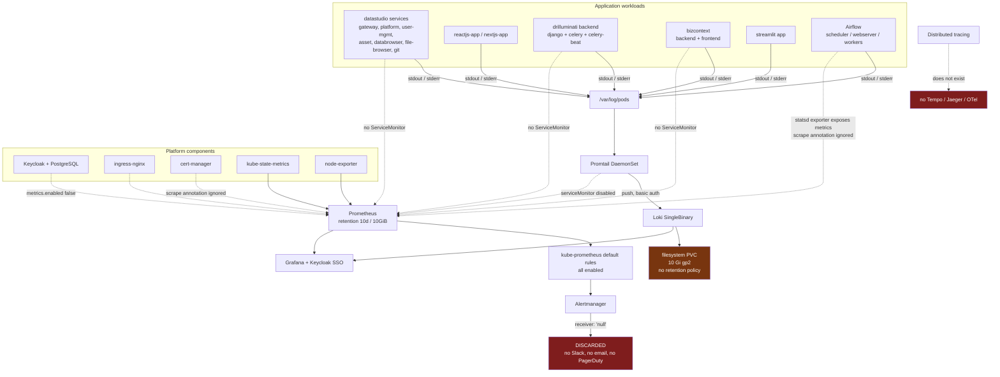
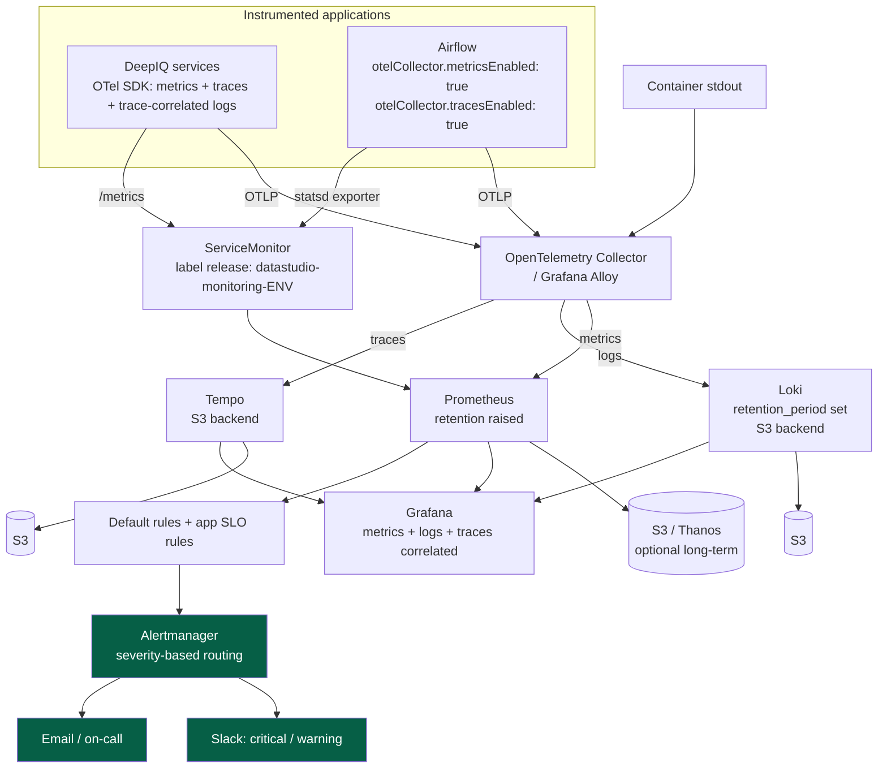

# Observability Current-State Survey

**Scope:** `helm-gitops` repository (GitOps source of truth) + previously captured live cluster output
**Date:** 19 August 2026
**Status:** Draft for review with @gvishnu
**Purpose:** Establish current observability coverage, identify gaps, recommend a tooling direction.

> **Evidence rules used in this document**
> - Every claim about configuration cites `path:line` in this repository. The repository is the GitOps source of truth, so it describes **declared** state.
> - Declared state is not the same as **running** state. Where the two could differ and no live check was permitted, the item is marked **OPEN**.
> - Facts derived from image or workload names are labelled **inferred**, not confirmed.

---

# 1. Executive Summary

**The headline finding is not that we lack an observability stack. It is that we have one and it is wired to discard its own output.**

`multi-tenant-cluster-apps/multi-tenant-init-apps/monitoring/` is a vendored **kube-prometheus-stack v70.2.1** (Prometheus Operator v0.81.0, Prometheus, Alertmanager, Grafana 8.10.x, kube-state-metrics, node-exporter) — `monitoring/Chart.yaml`. It is deployed automatically: `multi-tenant-datastudio-appsets/templates/multi-tenant-init-setup.yaml` uses an ArgoCD **git directory generator** over `multi-tenant-cluster-apps/multi-tenant-init-apps/*`, so every subdirectory becomes an Application named `datastudio-<dirname>-<env>` in a namespace equal to the directory name. Grafana is already integrated with Keycloak SSO.

Four independent breaks sit between that stack and any useful signal:

| # | Break | Evidence | Consequence |
|---|---|---|---|
| 1 | Alertmanager routes **every** alert to a receiver named `null` | `monitoring/values.yaml:531-542` | All alerts silently discarded, including the full kube-prometheus default rule set (`:168`) |
| 2 | No application ServiceMonitor or PodMonitor exists anywhere | verified across all application chart directories | Prometheus has nothing to scrape for our services |
| 3 | Even if one were added, the discovery label is wrong | `monitoring/values.yaml:4090` vs. `multi-tenant-datastudio-appsets/values.yaml` | `serviceMonitorSelectorNilUsesHelmValues: true` selects `release: datastudio-monitoring-<env>`; the repo declares `release: prometheus-stack` |
| 4 | Annotation-based scraping is disabled | `monitoring/values.yaml:4321` — `additionalScrapeConfigs: []` | Every `prometheus.io/scrape` annotation in the repo is inert, including Airflow's |

Logging works. Promtail (DaemonSet) ships container logs to Loki, and that path is intact. Its weaknesses are retention and durability, not collection.

Tracing does not exist. No Tempo, Jaeger, or OpenTelemetry deployment appears anywhere in the repository.

**Consequence for the recommendation:** the gap is *configuration*, not *capability*. The recommended direction (§12) is therefore to finish what is already deployed rather than to buy or build a new platform. The first three fixes are single-digit-line changes to files already in this repo.

---

# 2. Current Observability Stack

| Signal | Component | Declared state | Evidence | Assessment |
|---|---|---|---|---|
| Logs — collection | Promtail 3.x DaemonSet | Deployed, shipping to Loki | `promtail/values.yaml:425-430`, init-apps ApplicationSet | **Working** |
| Logs — storage | Loki, SingleBinary | Deployed, filesystem backend | `loki/values.yaml:56`, `:368` | Working, not durable |
| Logs — retention | None configured | No `retention_period` / `retention_enabled` | `loki/values.yaml:344-351` | **Gap** |
| Logs — capacity | 10 Gi PVC, gp2 | Hardcoded in chart | `loki/values.yaml:1440` | **Gap** (see §8.2) |
| Metrics — platform | kube-prometheus-stack 70.2.1 | Prometheus, Alertmanager, Grafana, KSM, node-exporter all enabled | `monitoring/Chart.yaml`; `values.yaml:393`, `:1217`, `:3349` | **Deployed** (running state OPEN) |
| Metrics — cluster/node | kube-state-metrics + node-exporter | Enabled as subcharts | `monitoring/Chart.yaml` dependencies | Working |
| Metrics — resource | Metrics Server | Deployed via init-apps | `multi-tenant-init-apps/metrics-server/` | Working (HPA use only) |
| Metrics — application | None | No ServiceMonitor / PodMonitor in any app chart | see §6.2 | **Gap — P1** |
| Metrics — retention | 10 d / 10 GiB on a 30 Gi PVC | `monitoring/values.yaml:4181`, `:4185`, `:4286` | Short; undersized volume unused | Gap |
| Traces | None | No Tempo/Jaeger/OTel in repo | repository-wide search | **Gap — P1** |
| Alerting — rules | kube-prometheus defaults, all enabled | `monitoring/values.yaml:168-200` | Rules exist and fire | Working |
| Alerting — routing | Single `null` receiver | `monitoring/values.yaml:531-542` | **Every alert discarded — P1** |
| Visualization | Grafana 8.10.x + Keycloak OIDC | `monitoring/values.yaml:1217-1235` | Deployed; dashboard inventory OPEN |
| Agent health | Promtail ServiceMonitor disabled | `promtail/values.yaml:270` | Log pipeline itself unmonitored |

---

# 3. How the stack is deployed (why this matters)

The deployment mechanism explains why the monitoring stack was easy to miss, and why fixes are cheap.

```
multi-tenant-datastudio-appsets/templates/multi-tenant-init-setup.yaml
   └── ApplicationSet: git directory generator
         path: multi-tenant-cluster-apps/multi-tenant-init-apps/*
              │
              ├── monitoring   → app datastudio-monitoring-<env>   → ns monitoring
              ├── loki         → app datastudio-loki-<env>         → ns loki
              ├── promtail     → app datastudio-promtail-<env>     → ns promtail
              ├── keycloak, ingress-nginx, external-dns, metrics-server, ...
              │
              └── values: ./values.yaml + ../../../environments/final-values.yaml
```

Three consequences:

1. **Adding a directory deploys it.** No appset edit is required to onboard a new observability component (e.g. Tempo).
2. **The Helm release name is `datastudio-<dirname>-<env>`.** This is the exact string Prometheus expects in the `release` label — the source of break #3 in §1.
3. **Sync policy is `automated` with `prune: true` and `selfHeal: true`.** Config fixes land without manual intervention, and out-of-band cluster edits are reverted. Fix it in the repo or it does not stick.

---

# 4. Current-State Architecture

Solid lines carry data today. Dashed lines are **declared but dead** — the configuration exists and produces nothing.



**Reading this diagram:** logs flow end to end. Cluster and node metrics flow. Application metrics do not exist. Alerts are generated and then thrown away. Traces do not exist.

---

# 5. Log Observability

## 5.1 Path

Application pods write to stdout/stderr → kubelet writes to `/var/log/pods` → Promtail DaemonSet tails and pushes → Loki → local filesystem PVC.

Promtail client configuration — `promtail/values.yaml:425-430`:

```yaml
clients:
  - url: http://datastudio-loki-dev.loki.svc.cluster.local:3100/loki/api/v1/push
    basic_auth:
      username: loki
      password: <committed in plaintext>
```

Loki configuration:

| Setting | Value | Evidence |
|---|---|---|
| Deployment mode | `SingleBinary` | `loki/values.yaml:56` |
| Object store | `filesystem` | `loki/values.yaml:368` |
| Path prefix | `/var/loki` | `loki/values.yaml:356` |
| Replication factor | 1 | `loki/values.yaml:357` |
| Persistence | 10 Gi, `storageClass: gp2` | `loki/values.yaml:1440-1445` |
| Retention | **not configured** | `loki/values.yaml:344-351` |
| Compactor | `{}` (defaults) | `loki/values.yaml:523` |
| Self-monitoring dashboards | disabled | `loki/values.yaml:3609` |

## 5.2 Gaps

- **No retention.** `limits_config` sets `reject_old_samples`, `query_timeout`, `split_queries_by_interval` and similar, but no `retention_period` and no `retention_enabled`. Nothing deletes old chunks.
- **No durability.** Filesystem backend with `replication_factor: 1` on a single PVC. Loss of the volume loses all history. Loki natively supports S3 (`loki/values.yaml:369-381`); the block exists and is unconfigured.
- **Finite capacity with no alarm.** 10 Gi with unbounded growth, and no alert can fire about it (§7).
- **The log pipeline is unmonitored.** `promtail/values.yaml:270` — `serviceMonitor.enabled: false`. If Promtail stops shipping, nothing notices; logs simply stop appearing.

## 5.3 What could not be determined from this repository

The issue asks for logging libraries, formats, and correlation IDs per service. **These are not determinable from a GitOps repository** — application source lives in the service repositories. What is visible here:

- All workloads log to stdout/stderr and rely on container log collection. No service mounts a log file volume or ships logs independently.
- No `LOG_FORMAT`, `LOG_LEVEL`, or structured-logging environment variable appears in any application chart's ConfigMap or Deployment.
- **No cross-service correlation or request ID mechanism is configured anywhere.** This is the finding that matters: without one, and without traces, correlating a request across gateway → platform → backend is manual timestamp matching.

**Action:** to complete this section, inspect the application repositories for the gateway, platform, and drilluminati backend services and record logging library, output format, and whether any request ID header is propagated.

---

# 6. Metrics Observability

## 6.1 What is collected today

Prometheus is deployed and scraping its own bundled exporters: kube-state-metrics and node-exporter (subchart dependencies in `monitoring/Chart.yaml`). Cluster-level and node-level metrics are therefore available. Metrics Server is separately deployed and serves the resource-metrics API used by HPAs — it is not a metrics store and is not a substitute for Prometheus.

Prometheus retention — `monitoring/values.yaml`:

```
retention:     10d      (:4181)
retentionSize: 10GiB    (:4185)
storageSpec:   30Gi     (:4286)
```

Note the mismatch: retention is capped at 10 GiB while the volume is 30 Gi. Two thirds of the provisioned disk is unusable under current settings.

## 6.2 Why no application metrics reach Prometheus

Three independent causes. All three must be fixed; fixing any one alone changes nothing.

**Cause A — nothing to discover.**
No `ServiceMonitor` or `PodMonitor` resource exists in any application chart. Verified across:
- `multi-tenant-cluster-apps/datastudio-dev/*` (18 service charts)
- `multi-tenant-cluster-apps/multi-tenant-self-apps/*`
- `customer/multi-tenant/3535353535/*`
- `customer/ri_tree/3535353535/*`

The application charts are minimal — `ds-gateway`, for example, contains only `Chart.yaml`, `deployment.yaml`, `configmap.yaml`, `horizantal.yaml`. There is no metrics surface and no service-discovery object.

**Cause B — the discovery label is wrong.**
`monitoring/values.yaml:4090` sets `serviceMonitorSelectorNilUsesHelmValues: true` (and `:4113` for PodMonitors, `:4065` for PrometheusRules). Under this setting Prometheus selects only objects labelled `release: <helm release name>`. The release name produced by the ApplicationSet is `datastudio-monitoring-<env>`.

But `multi-tenant-datastudio-appsets/values.yaml` declares:

```yaml
prometheus:
  servicemonitor:
    enabled: true
    labels:
      release: prometheus-stack
```

`prometheus-stack` is not the release name. Any ServiceMonitor created with this label — including ones generated by subcharts consuming this value — is invisible to Prometheus. This is a silent failure: the object exists, `kubectl get servicemonitor` shows it, and no target ever appears.

**Cause C — annotation-based scraping is off.**
`monitoring/values.yaml:4321` — `additionalScrapeConfigs: []`. kube-prometheus-stack does not honour `prometheus.io/scrape` annotations unless a scrape config is added. The repository contains several such annotations, all currently inert:

| Component | Annotation location | Status |
|---|---|---|
| Airflow statsd exporter | `customer/airflow-cluster/3535353535/airflow-3535353535/templates/statsd/statsd-service.yaml:38` | inert |
| Airflow pgbouncer | `.../templates/pgbouncer/pgbouncer-service.yaml:38` | inert |
| Keycloak metrics service | `multi-tenant-init-apps/keycloak/values.yaml:1110` | inert, and `metrics.enabled: false` (`:1093`) |
| cert-manager | live pod annotation | inert |

The earlier draft of this survey cited the cert-manager annotation as evidence that scraping works. It is the opposite: it is evidence of a path that looks configured and collects nothing.

## 6.3 Missing application signal

Not available for any DeepIQ service today: HTTP request rate, error rate, latency distribution, request-duration percentiles, in-flight requests, Celery queue depth, Celery task failure rate, Django DB connection pool state, job success/failure counts, and any business-level metric.

---

# 7. Alerting

## 7.1 Rules exist and fire

`monitoring/values.yaml:168-200` enables the complete kube-prometheus default rule set — `alertmanager`, `etcd`, `general`, `k8s`, `kubeApiserver*`, `kubelet`, `kubeProxy`, `kubePrometheusGeneral`, `kubeStateMetrics`, `network`, `node`, `nodeExporterAlerting`, `nodeExporterRecording`, `prometheus`, `prometheusOperator`, `windows`. `appNamespacesTarget: ".*"`.

So Prometheus is evaluating rules for node pressure, disk exhaustion, pod crash-looping, API server latency, and dozens more. These alerts are firing.

## 7.2 They go nowhere

`monitoring/values.yaml:531-542`:

```yaml
route:
  group_by: ['namespace']
  group_wait: 30s
  group_interval: 5m
  repeat_interval: 12h
  receiver: 'null'          # <-- default route for every alert
  routes:
  - receiver: 'null'
    matchers:
      - alertname = "Watchdog"
receivers:
- name: 'null'              # <-- the only receiver defined
```

This is the stock kube-prometheus-stack default, unmodified. The `null` receiver has no `slack_configs`, `email_configs`, `pagerduty_configs`, or webhook. **Every alert in the cluster is routed to it and discarded.**

There is no notification path. `KubePodCrashLooping`, `NodeFilesystemAlmostOutOfSpace`, `KubePersistentVolumeFillingUp` — the alert that would warn about the 10 Gi Loki volume — all fire and vanish.

## 7.3 Correction to the previous draft

The earlier draft inferred the alerting state from `kubectl get applications,applicationsets -A` returning nothing. That command reports whether ArgoCD's CRDs are visible in the current kube-context. It says nothing about Alertmanager. That inference is withdrawn; the finding above is from configuration and is definite.

## 7.4 Severity

This is the highest-value, lowest-effort fix in this document. Adding receivers and a severity route is a contained edit to one file, and the automated sync policy (§3) applies it without manual steps.

---

# 8. Storage and Retention

## 8.1 Loki

No retention policy, filesystem backend, `replication_factor: 1`, 10 Gi. Covered in §5.2.

## 8.2 `LOKI_STORAGE_SIZE` is dead configuration

`LOKI_STORAGE_SIZE: 200Gi` is declared in four environment files:

```
environments/defaults.yaml:29
environments/dev/values.yaml:74
environments/final-values.yaml:157
environments/ms-values.yaml:79
```

A repository-wide search finds **no template or chart that consumes this key**. The Loki chart uses its own hardcoded `singleBinary.persistence.size: 10Gi` (`loki/values.yaml:1440`).

This explains the 10 Gi PVC observed in the cluster despite a declared 200 Gi. Anyone reading the environment files would reasonably conclude Loki has 200 Gi. It has 10 Gi. Either wire the value through to `singleBinary.persistence.size` or delete it from all four files — leaving it is worse than either.

## 8.3 Prometheus

`retention: 10d`, `retentionSize: 10GiB`, volume 30 Gi. Ten days is short for capacity planning and post-incident review, and the size cap wastes two thirds of the volume.

---

# 9. Distributed Tracing

No tracing backend, collector, or instrumentation exists. Repository-wide searches for `tempo`, `jaeger`, `opentelemetry`, `otel`, `traceparent`, and `OTEL_` return no deployment or configuration outside of the Airflow chart's disabled feature flags (§10).

**Impact.** With no traces and no correlation ID (§5.3), diagnosing a slow or failing request that crosses gateway → platform → backend → database means manually aligning timestamps across separate log streams in Grafana. Cost grows with the number of hops and is worst exactly when it matters most.

**Nearest available starting point.** The Airflow chart already ships an OTel collector integration behind a boolean (§10). That is the cheapest possible tracing pilot in the estate.

---

# 10. Airflow Observability

The previous draft left this as "requires verification." It is resolvable from the repository.

`customer/airflow-cluster/3535353535/airflow-3535353535/values.yaml`:

| Setting | Line | Value |
|---|---|---|
| `statsd.enabled` | 3575 | `true` |
| `otelCollector.tracesEnabled` | 3690 | `false` |
| `otelCollector.metricsEnabled` | 3693 | `false` |
| `otelCollector.metricExportIntervalMs` | 3697 | `30000` |

Rendered Airflow config (`:4441`, `:4445`, `:4449`) sets `statsd_on: True` and both `otel_on` flags to `False`.

**So the chain is:** Airflow emits StatsD metrics → the statsd exporter runs and converts them to Prometheus format → its Service carries `prometheus.io/scrape: "true"` (`templates/statsd/statsd-service.yaml:38`) → **and nothing scrapes it**, because annotation scraping is off (§6.2 Cause C) and this chart has **no ServiceMonitor template at all**.

Notably, the older chart version did: `customer/airflow-cluster/3535353535/airflow-3535353535-v1/templates/webserver/webserver-service-monitor.yaml` exists, along with `webserver-prometheus-rule.yaml`. The capability regressed between chart versions.

**Conclusion:** Airflow scheduler, DAG, and task metrics are generated and exposed on a live endpoint right now. They are simply never collected. Adding one correctly-labelled ServiceMonitor makes the entire existing Airflow metric set visible with no application change.

The same chart's `otelCollector` block also offers traces behind a single boolean, with an overridable collector config (`:3699-3713`).

---

# 11. System Inventory

**Owner** and **criticality** cannot be derived from this repository and are required by the issue. They are marked `TBD` so the gap is visible rather than silently absent — these need filling before the review.

Language/framework entries marked *(inferred)* come from image or workload naming, not from source inspection.

## 11.1 Application workloads

| Namespace | Workload | Runtime / framework | Owner | Criticality | Logs | Metrics | Traces |
|---|---|---|---|---|---|---|---|
| `datastudio` | gateway-service | *(inferred)* service container | TBD | TBD | stdout → Loki | none | none |
| `datastudio` | platform-service | *(inferred)* | TBD | TBD | stdout → Loki | none | none |
| `datastudio` | user-management-service | *(inferred)* | TBD | TBD | stdout → Loki | none | none |
| `datastudio` | asset-service (asset-hierarchy) | *(inferred)* | TBD | TBD | stdout → Loki | none | none |
| `datastudio` | databrowser-service | *(inferred)* | TBD | TBD | stdout → Loki | none | none |
| `datastudio` | file-browser-service | *(inferred)* | TBD | TBD | stdout → Loki | none | none |
| `datastudio` | git-service | *(inferred)* | TBD | TBD | stdout → Loki | none | none |
| `datastudio` | metadata-dbservice | *(inferred)* | TBD | TBD | stdout → Loki | none | none |
| `datastudio` | mlflow | MLflow | TBD | TBD | stdout → Loki | none | none |
| `datastudio` | azure-databricks / cloud-vaults / apim | *(inferred)* | TBD | TBD | stdout → Loki | none | none |
| `datastudio` | reactjs-app | React *(inferred)* | TBD | TBD | stdout → Loki | none | none |
| `datastudio` | nextjs-app | Next.js *(inferred)* | TBD | TBD | stdout → Loki | none | none |
| `bizcontext` | backend-service | *(inferred)* | TBD | TBD | stdout → Loki | none | none |
| `bizcontext` | frontend-service | *(inferred)* | TBD | TBD | stdout → Loki | none | none |
| `drilluminatibackend` | django-service | Django *(inferred)* | TBD | TBD | stdout → Loki | none | none |
| `drilluminatibackend` | celery-service | Celery *(inferred)* | TBD | TBD | stdout → Loki | none | none |
| `drilluminatibackend` | celery-beat-service | Celery beat *(inferred)* | TBD | TBD | stdout → Loki | none | none |
| `drilluminatidemointernal` | django / celery / celery-beat | Django + Celery *(inferred)* | TBD | TBD | stdout → Loki | none | none |
| `streamlit-3535353535` | streamlitappdjango-service | Streamlit + Django *(inferred)* | TBD | TBD | stdout → Loki | none | none |
| `deepsql*` (self-apps) | deepsql, deepsql-celery, deepsql-flower, deepsql-dev-chat | *(inferred)* | TBD | TBD | stdout → Loki | none | none |
| airflow cluster | scheduler / webserver / workers / triggerer | Airflow (Python) | TBD | TBD | stdout → Loki | **exposed, not scraped** (§10) | available, disabled |
| airflow cluster | statsd exporter | Prometheus exporter | TBD | TBD | stdout → Loki | **exposed, not scraped** | n/a |
| airflow cluster | pgbouncer | PgBouncer | TBD | TBD | stdout → Loki | exposed, not scraped | n/a |
| `msstudio` | msstudio services | *(inferred)* | TBD | TBD | TBD — parity unverified | none | none |

## 11.2 Platform and infrastructure

| Component | Source | Metrics state |
|---|---|---|
| Prometheus / Alertmanager / Grafana | `multi-tenant-init-apps/monitoring/` | self-monitored; alerts discarded (§7) |
| kube-state-metrics | monitoring subchart | scraped |
| node-exporter | monitoring subchart | scraped |
| Metrics Server | `multi-tenant-init-apps/metrics-server/` | resource API only |
| Loki | `multi-tenant-init-apps/loki/` | exposes metrics; dashboards disabled (`:3609`) |
| Promtail | `multi-tenant-init-apps/promtail/` | exposes metrics; ServiceMonitor disabled (`:270`) |
| Keycloak + PostgreSQL | `multi-tenant-init-apps/keycloak/` | `metrics.enabled: false` (`:1093`); ServiceMonitor false (`:1119`) |
| ingress-nginx | `multi-tenant-init-apps/ingress-nginx/` | scrape annotations commented out (`:677`) |
| cert-manager | cluster | annotation present, inert |
| external-dns, external-secrets | init-apps | not monitored |
| AWS VPC CNI, CoreDNS, kube-proxy, EBS/EFS CSI | EKS addons | covered by kube-prometheus default rules |

## 11.3 Footprint

The estate spans more than one cluster and more than one cloud, which affects any centralization decision:

- **Dev**: `CLOUD_PROVIDER: azure`, registry `devds.azurecr.io` (`environments/dev/values.yaml`)
- **ArgoCD target cluster**: AWS EKS, `us-east-1` (`multi-tenant-datastudio-appsets/values.yaml`)
- **Airflow cluster**: separate app tree — `airflow_cluster_apps/`, `airflow-appsets/`
- **msstudio**: separate namespace and appset path
- **Customer env `3535353535`**: `environments/final-values.yaml`, domain `deepiq.com`

QA and production parity is **OPEN** — this survey covers the dev/customer configuration in this branch only.

---

# 12. Top Pain Points

> **This section is to be completed by the investigation owner.** Concrete recent examples are required by the Definition of Done and cannot be derived from configuration. Structure for each:

### Pain point 1 — <name>
- **Scenario:**
- **What breaks:**
- **What we do today:**
- **Where the trail goes cold:**
- **Recent example (date + what happened):**

### Pain point 2 — <name>
*(same structure)*

### Pain point 3 — <name>
*(same structure)*

### Pain point 4 — <name>
*(same structure)*

### Pain point 5 — <name>
*(same structure)*

**Configuration-derived context to draw on when filling these in:** no alert ever reaches a human (§7); no application error rate or latency exists (§6); no request can be followed across services (§5.3, §9); Airflow task failures produce metrics nobody sees (§10); Loki has no retention, so how far back logs go is unknown and unbounded (§5.2).

---

# 13. Blockers to Centralization

| Blocker | Status | Detail |
|---|---|---|
| Multi-cloud split | **Confirmed** | Azure (dev) and AWS EKS coexist (§11.3); a central backend must be reachable from both |
| Separate Airflow cluster | **Confirmed** | Own app tree and appsets; needs its own agent/collector rollout |
| Secrets in plaintext in Git | **Confirmed** | Promtail Loki password (`promtail/values.yaml:430`), Grafana Keycloak client secret (`monitoring/values.yaml`), Azure keys and service-account credentials (`environments/dev/values.yaml`). Bears directly on whether telemetry may be sent to a third party, and warrants its own remediation issue |
| PII in logs | **OPEN** | Not assessable from configuration; requires sampling actual log content |
| Log volume | **OPEN** | Unknown; blocks any firm managed-platform cost estimate |
| Customer data residency | **OPEN** | May customer telemetry leave DeepIQ infrastructure? Gates Option A entirely |
| Network isolation / on-prem | **OPEN** | No on-prem deployment appears in this repository; confirm whether any exists |

---

# 14. Tooling Options

## Option A — Managed platform (Grafana Cloud, Datadog, New Relic)

| Axis | Assessment |
|---|---|
| Cost | Recurring, usage-based; unquantifiable until log volume is measured |
| Operational burden | Low — vendor handles storage, upgrades, scaling |
| Instrumentation effort | **Same as Option B.** Application code must still be instrumented; a managed backend does not create metrics that do not exist |
| Vendor lock-in | High unless instrumentation is OpenTelemetry |
| Footprint fit | Works across Azure + AWS; requires egress from both |
| Blocker | Data residency (§13) is unresolved and may rule this out outright |

## Option B — Consolidate the self-hosted stack **(recommended)**

Prometheus (metrics) · Loki (logs) · Tempo (traces) · Grafana (visualization) · Alertmanager (alerting) · OpenTelemetry (instrumentation) · S3 (durable storage) · Grafana Alloy (agent, later)

| Axis | Assessment |
|---|---|
| Cost | Marginal. Prometheus, Alertmanager, Grafana, Loki, and Promtail are **already deployed and already paid for** in EKS compute. Incremental spend is Tempo compute plus S3 |
| Operational burden | Already carried. The team already owns this stack; the alternative adds a vendor without removing it |
| Instrumentation effort | Same as Option A |
| Vendor lock-in | None. OpenTelemetry instrumentation keeps a future move cheap |
| Footprint fit | Already running in the target clusters |
| Time to first value | **Days.** The first three fixes are edits to files in this repo |

## Option C — Hybrid / OTel-first, backend deferred

| Axis | Assessment |
|---|---|
| Cost | Lowest short-term |
| Operational burden | Deferred, not removed |
| Instrumentation effort | Same |
| Vendor lock-in | None |
| Weakness | **Solves none of the four breaks in §1.** Alerts still route to `null`, Loki still has no retention. Instrumenting an application whose alerts go nowhere does not improve the on-call situation |

---

# 15. Recommendation

## Recommended: **Option B — consolidate the self-hosted stack**

The reasoning is different from what a first look suggested. This is not "adopt Prometheus and Grafana." Prometheus and Grafana are deployed, Keycloak-integrated, and running. This is **"connect the stack we already deployed to the signals it was installed to collect."**

Three of the four blocking problems (§1) are configuration defects in files in this repository, fixable in hours, with automated sync applying them. Nothing about the current situation suggests the stack is unsuitable — it suggests it was installed and never finished.

## Runner-up: **Option A — managed platform (Grafana Cloud)**

**Why it lost.** It requires paying recurrently for capability the organization already owns and operates. The gaps identified are configuration, not capability, so a managed backend would resolve none of them faster — a `null` receiver in Grafana Cloud discards alerts exactly as effectively. Instrumentation effort, the largest real cost in this programme, is identical under both options. It is also gated on an unresolved data-residency question (§13). It would become the right answer if operating this stack proved to consume disproportionate team time — which OpenTelemetry instrumentation keeps as a cheap future move.

**Option C** placed last: it defers the decision without fixing anything currently broken.

## Proposed target state



---

# 16. Gap Analysis

| Priority | Gap | Impact | Fix | File |
|---|---|---|---|---|
| **P1** | Alertmanager discards every alert | No notification path exists for any failure | Define receivers + severity routes | `monitoring/values.yaml:531-542` |
| **P1** | ServiceMonitor `release` label mismatch | Any monitor added would be silently ignored | Set label to `datastudio-monitoring-<env>` | `multi-tenant-datastudio-appsets/values.yaml` |
| **P1** | No application ServiceMonitors | No application metrics at all | Add ServiceMonitor to app charts | `datastudio-dev/*`, `customer/multi-tenant/*` |
| **P1** | Loki has no retention | Unbounded growth on a 10 Gi volume | Set `retention_period` + enable compactor retention | `loki/values.yaml:344-351` |
| **P1** | Loki not durable | Volume loss = total log loss | Configure S3 backend | `loki/values.yaml:369-381` |
| **P2** | Airflow metrics exposed but unscraped | Task and DAG failures invisible | Add ServiceMonitor for statsd exporter | Airflow chart templates |
| **P2** | `LOKI_STORAGE_SIZE` is dead config | Declared 200 Gi, actual 10 Gi | Wire through or delete from all four files | `environments/*.yaml`, `loki/values.yaml:1440` |
| **P2** | No distributed tracing | Cross-service debugging is manual | Deploy Tempo; enable Airflow OTel traces first | new `multi-tenant-init-apps/tempo/` |
| **P2** | No application instrumentation | No RED metrics, no traces | OpenTelemetry SDK, one pilot service first | application repositories |
| **P2** | Prometheus retention 10 d / 10 GiB on 30 Gi | Short history; disk wasted | Raise `retention` and `retentionSize` | `monitoring/values.yaml:4181`, `:4185` |
| **P2** | Log pipeline unmonitored | Silent log-shipping failure | Enable Promtail ServiceMonitor | `promtail/values.yaml:270` |
| **P2** | Secrets committed in plaintext | Credential exposure; blocks telemetry export decisions | Move to External Secrets (already deployed) | `promtail/values.yaml:430`, `monitoring/values.yaml`, `environments/dev/values.yaml` |
| **P3** | Promtail is the legacy agent | Long-term support risk | Plan migration to Grafana Alloy | `multi-tenant-init-apps/promtail/` |
| **P3** | No logging standard across services | Unstructured, uncorrelatable logs | Define structured JSON + request ID standard | application repositories |
| **P3** | Alert ownership and routing undefined | Alerts may reach the wrong team | Define severity taxonomy and on-call routing | — |
| **P3** | QA/prod parity unverified | Coverage may differ per environment | Repeat this inventory per cluster | — |

---

# 17. Proposed Follow-up Work

Ordered cheapest-first, so each step delivers value before the next begins.

| # | Work | Effort | File(s) |
|---|---|---|---|
| 1 | Configure Alertmanager receivers and severity routing | hours | `monitoring/values.yaml` |
| 2 | Fix the ServiceMonitor `release` label | minutes | `multi-tenant-datastudio-appsets/values.yaml` |
| 3 | Add ServiceMonitor for the Airflow statsd exporter — first real application metrics, no code change | hours | Airflow chart |
| 4 | Configure Loki retention | hours | `loki/values.yaml` |
| 5 | Resolve `LOKI_STORAGE_SIZE` — wire through or delete | hours | `environments/*.yaml` |
| 6 | Raise Prometheus retention to match the volume | minutes | `monitoring/values.yaml` |
| 7 | Enable Promtail ServiceMonitor and add a log-pipeline alert | hours | `promtail/values.yaml` |
| 8 | Move Loki durable storage to S3 | days | `loki/values.yaml` |
| 9 | Audit Grafana dashboards; add golden-signal dashboards | days | Grafana |
| 10 | Move committed secrets to External Secrets | days | multiple |
| 11 | Instrument one pilot service with OpenTelemetry | weeks | application repo |
| 12 | Enable Airflow OTel traces — cheapest tracing pilot | days | Airflow `values.yaml:3690` |
| 13 | Deploy Tempo as a new init-apps directory | days | new directory |
| 14 | Define and apply an observability standard for all app charts | weeks | all app charts |
| 15 | Migrate Promtail to Grafana Alloy | weeks | init-apps |
| 16 | Repeat this inventory for QA, production, and msstudio | days | — |

---

# 18. Cost

**These are planning estimates, not quotes.** No pricing figure here is verified against a current vendor price sheet, and none should be quoted externally without checking. Actual cost is dominated by telemetry volume, which is currently unmeasured (§19).

## Self-hosted (Option B)

| Item | Estimate |
|---|---|
| Prometheus, Alertmanager, Grafana, Loki, Promtail | **$0 incremental** — already deployed on existing EKS nodes |
| S3 for durable Loki/Tempo chunks | Low tens of USD/month per TB at standard rates; requests and transfer additional |
| Tempo compute | Additional EKS resource; sizing depends on trace volume and sampling |
| Prometheus storage increase | Incremental EBS on existing nodes |
| Grafana Alloy | Replaces Promtail; CPU/memory only, no new licence |
| **Incremental total** | **Small relative to existing EKS spend.** The recommendation adds Tempo and S3 to a stack already funded |

## Managed (Option A)

Not estimable today. A credible number requires daily log ingest volume, metric series cardinality, trace volume, and target retention — none of which are measured. Vendors price on ingest and retention, so estimating without volume produces a number that will be wrong by an order of magnitude in either direction.

**Do not commit to a managed-platform cost claim until §19 Q1 and Q2 are answered.**

---

# 19. Open Questions

1. **What is the actual daily log ingestion volume?** Blocks every cost estimate.
2. **How much data does Loki currently hold, and how far back does it reach?** With no retention policy the answer is not inferable.
3. **Is the `monitoring` ArgoCD application synced and healthy?** The repository proves it is *declared*; the earlier live pod inventory did not show it. This must be confirmed before acting on §17. *(Not checkable within this survey's constraints.)*
4. **Which Grafana dashboards exist today, and does anyone use them?**
5. **May customer telemetry leave DeepIQ infrastructure?** Gates Option A entirely.
6. **Do QA and production use the same init-apps ApplicationSet?** If so, they inherit the same `null` receiver and the same missing retention.
7. **Who owns alert routing and on-call?** No routing can be configured without this.
8. **Which channels should receive critical vs. warning alerts?**
9. **What retention is required for logs, metrics, and traces** — operationally and for compliance?
10. **Do any logs contain PII?** Requires sampling real log content.
11. **Which service should be the OpenTelemetry pilot?** Gateway is the natural candidate as the request entry point.

---

# 20. Definition of Done — status

| Requirement | Status |
|---|---|
| Every service/pipeline appears in the inventory with observability state | Done (§11); owner and criticality columns need team input |
| Top pain points written with concrete examples | **Outstanding — §12, owner to complete** |
| One recommended stack with reasoning | Done (§15) |
| Runner-up named with why it lost | Done (§15) |
| Diagrams readable by someone who did not investigate | Done (§4 current, §15 proposed) |
| Reviewed with @gvishnu | Pending |
| Follow-up implementation issues identified | Done (§17) — ready to file |

---

# 21. Final Assessment

The environment is better equipped than a first inspection suggests and less functional than that equipment implies.

Deployed and working: Prometheus, Alertmanager, Grafana with Keycloak SSO, kube-state-metrics, node-exporter, Loki, Promtail, Metrics Server. Cluster and node metrics are collected. Logs flow end to end.

Deployed and inert: every alert the cluster generates is routed to a receiver named `null` and discarded. Prometheus cannot discover any application even if one were instrumented, for two independent reasons. Airflow's metrics are live on an endpoint nobody scrapes. Loki writes to a 10 Gi volume with no retention policy and no durability, while four environment files declare a 200 Gi size that no template reads.

Absent entirely: application instrumentation, distributed tracing, and any request-correlation mechanism.

The recommended path is Option B — finish the stack that is already deployed. The first three items in §17 restore a working alerting path and produce the first real application metrics, and all three are edits to files in this repository.
